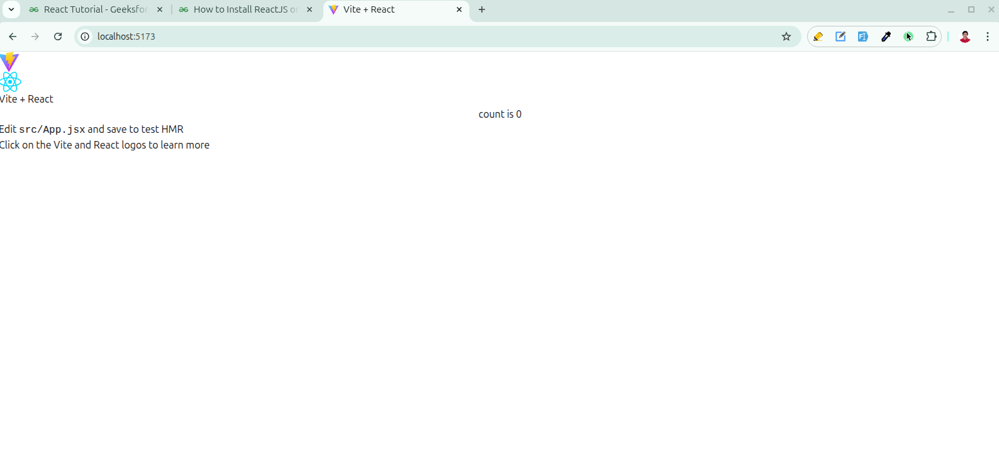
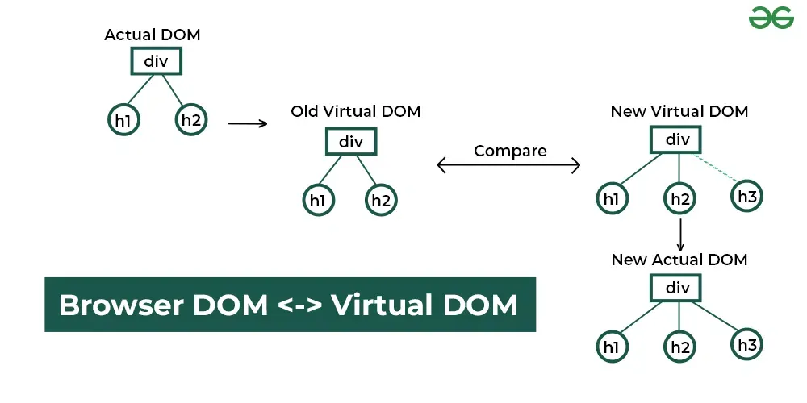
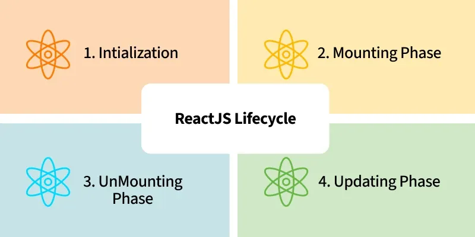

<h1 align="center">React Notes</h1>

<h4>Table of Contents</h4>

- [Introduction](#introduction)
    - [Why Learn React:](#why-learn-react)
    - [Create React App with Vite:](#create-react-app-with-vite)
    - [Hello, World:](#hello-world)
    - [How does react works:](#how-does-react-works)
    - [Key Features of React](#key-features-of-react)
    - [ReactJS Lifecycle](#reactjs-lifecycle)


# Introduction
React is a powerful JavaScript frontend-library Created by Facebook. it's known for its re-usable component-based structure, single-page applications (SPAs), and virtual DOM.


### Why Learn React: 
Before React, front-end development struggled with:

- Manual DOM Manipulation: Traditional JavaScript directly modified the DOM, slowing down the performance.
- Complex State Management: Maintaining UI state became messy and hard to debug. 

React solved these issues with a modern and modular approach:

- Virtual DOM: React updates only the changed parts of the DOM, resulting in faster rendering.
- One-Way Data Binding: Ensures predictable and easy to debug data flow.
- Component-Based Architecture: Breaks UI into reusable pieces, improving the code reusability and scalability.

### Create React App with Vite:

Vite is a modern build tool that offers lightning-fast startup and optimized development experience for React and other frameworks.

**Step 1: Create React App with Vite** 
```bash
npm create vite@latest project-name -- --template react
```

**Step 2:  Install Dependencies**

```bash
cd my-react-app
npm i tailwindcss @tailwindcss/vite -D daisyui@latest
```

**Step 3: run you project on vs code**

```js
code .
```

**step 4: setup tailwind and daisyui:**

vite.config.js:

```js
import { defineConfig } from 'vite'
import react from '@vitejs/plugin-react'
import tailwindcss from '@tailwindcss/vite'

// https://vite.dev/config/
export default defineConfig({
  plugins: [react(), tailwindcss()],
})
```

Import Tailwind CSS and daisyUi to index.css:

```js
@import "tailwindcss";
@plugin "daisyui";
```

**step 5: Run the development server:**

```bash
npm run dev
```




### Hello, World:

```jsx
// app.jsx
import React from 'react';

const App = () => {
  return (
    <div>
      <h1>Hello World</h1>
    </div>
  );
};

export default App;
```
here, 
- import React from 'react'; = This imports the React library for understand jsx and react features.
- function App() { ... } = This defines a React functional component named App that returns JSX code.
- export default App = Exports the App component so it can be used elsewhere.

### How does react works: 
React operates by creating an in-memory virtual DOM rather than directly manipulating the browser’s DOM. It performs necessary manipulations within this virtual representation before applying changes to the actual browser DOM.



here, 
- Initially, there is an Actual DOM(Real DOM) containing a div with two child elements: h1 and h2. React maintains a previous Virtual DOM to track the UI state before any updates.
- When a change occurs (e.g., adding a new h3 element), React generates a New Virtual DOM. React compares the previous Virtual DOM with the New Virtual DOM using a process called reconciliation.
- React identifies the differences (in this case, the new h3 element). Instead of updating the entire DOM, React updates only the changed part in the New Actual DOM, making the update process more efficient.
  
### Key Features of React

1. Virtual DOM: 
2. Component-Based Architecture
3. JSX (JavaScript XML)
   - React usesJSX, a syntax extension that allows developers to write HTML inside JavaScript. JSX makes the
4. One-Way Data Binding
   - React uses one-way data binding, meaning data flows in a single direction from parent components to child components via props
5. State Management
   - React manages component state efficiently using the useState hook (for functional components) or this.state (for class components). State allows dynamic updates without reloading the page.
6. React Hooks
   - Hooks allow functional components to use state and lifecycle features without needing class components. 
7. React Router
   - React provides React Router for managing navigation in single-page applications (SPAs). It enables dynamic routing without requiring full-page reloads.

### ReactJS Lifecycle
Every React Component has a lifecycle of its own, the lifecycle of a component can be defined as the series of methods that are invoked in different stages of the component’s existence.



