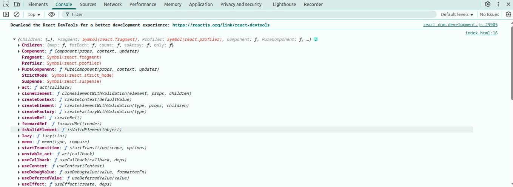
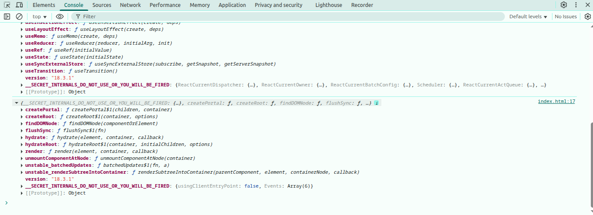
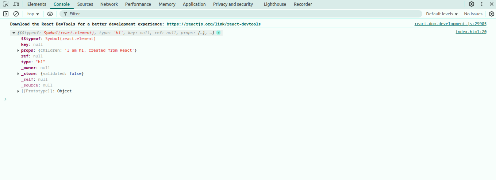
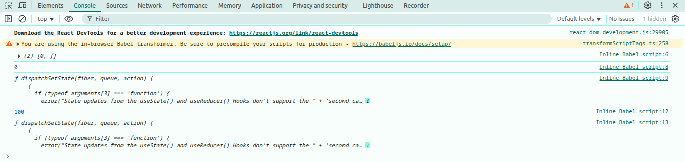

<h1 align="center">React Notes</h1>

<h4>Table of Contents</h4>


- [Introduction](#introduction)
    - [The story of react:](#the-story-of-react)
    - [what is components:](#what-is-components)
    - [what is virtual DOM and How virtual dom work:](#what-is-virtual-dom-and-how-virtual-dom-work)
    - [library vs framework](#library-vs-framework)
    - [react vs next vs vue](#react-vs-next-vs-vue)
    - [Create React App with Vite:](#create-react-app-with-vite)
- [jsx](#jsx)
    - [How JSX Works behind the scenes:](#how-jsx-works-behind-the-scenes)
    - [JSX rules:](#jsx-rules)
- [Props, callback function, context api](#props-callback-function-context-api)
    - [props](#props)
    - [Passing Data Using Callback Functions:](#passing-data-using-callback-functions)
    - [Context API](#context-api)
    - [what is the difference between props, callback function and context api](#what-is-the-difference-between-props-callback-function-and-context-api)
- [Event Handling in react](#event-handling-in-react)
- [useState()](#usestate)
- [data loading in react](#data-loading-in-react)
    - [using use() with suspense:](#using-use-with-suspense)
    - [using useEffect()](#using-useeffect)
- [react component lifecycle](#react-component-lifecycle)
- [useEffect](#useeffect)


# Introduction

React is a component-based JavaScript frontend library developed by Facebook for building dynamic and interactive user interfaces, especially for single-page applications. It allows developers to create reusable UI components with efficiently update the DOM using a virtual DOM.

### The story of react:

Back in the early 2010s, Facebook engineers were in trouble. Their web applications, especially the news feed and the ads system, needed frequent updates. Every little change meant updating the real DOM directly — and that was slow, clunky, and full of bugs. The UI became harder to manage, and performance dropped.

In 2011, one Facebook engineer, Jordan Walke, decided to experiment. He built a prototype called FaxJS. The idea was bold: instead of updating the DOM directly, create a Virtual DOM — a lightweight copy of the actual DOM. Whenever something changed, compare the new Virtual DOM with the old one, and then update only the parts that actually changed in the real DOM. The results were stunning. Suddenly, apps ran smoother and faster.

By 2012, this new approach was powering Facebook news feeds and Ads, and later, Instagram. The success inside Facebook was undeniable.

Then came 2013. At JSConf US, Facebook decided to release this tool to the world. At first, developers didn’t know what to make of it. JSX — writing HTML inside JavaScript — looked strange. Some argued it broke the rules of traditional MVC (is a design pattern that separates an application into three parts: model, view, controller) patterns. A few even called it “the worst idea ever.”

By 2014, people started noticing that React apps were faster, more predictable, and easier to maintain. The component-based architecture encouraged reuse, and teams could build complex interfaces without drowning in spaghetti code.

Then came 2015, a breakthrough year. Big companies like Netflix, airBnb adopted React. The state management library Redux was released, solving complex data flow issues. React Native made it possible to use the same principles to build mobile apps for iOS and Android. Even developer tools like the React DevTools browser extension were launched, making debugging easier. React was no longer just a Facebook experiment — it was becoming the industry standard.

Over the following years, React kept evolving. Updates brought new features, performance boosts, and better developer experience. One of the biggest shifts came with Hooks (like useState, useEffect, and useContext). With Hooks, developers no longer needed class components for state and lifecycle management. Functional components became powerful and simple, and writing React apps became cleaner than ever.

From a hack at Facebook to a global phenomenon, React completely changed the way we think about building user interfaces. Today, React powers not only web applications but also mobile apps (React Native), desktop apps, and even experiments in VR.

### what is components:
A component is basically a reusable, independent piece of UI. Components can be small (like a button) or large (like a whole form or page).


### what is virtual DOM and How virtual dom work:
The Virtual DOM is a lightweight, in-memory copy of the real DOM.


Here, we have a component that has a `<div>` and inside the `<div>` two elements:
- First, React creates a Virtual DOM for this component, based on the actual DOM.
- Then, when we change something—like adding a new `<h3>` element—React creates a new Virtual DOM for the updated component.
- Next, React compares the newly created Virtual DOM with the previous Virtual DOM. This process is called diffing.
- After comparing, React updates only the parts of the real DOM that changed. This process is called reconciliation.


### library vs framework


| library                                                                                                                                                  | framework                                                                                                                             |
| -------------------------------------------------------------------------------------------------------------------------------------------------------- | ------------------------------------------------------------------------------------------------------------------------------------- |
| A library is a collection of pre-written code that you can pick and use whenever you need. You decide when to call it and how to use it in your program. | A framework is a pre-defined structure that you must follow to build your application. It decides when your code runs and how to use. |
| you cal the library, means you decide when and how to use it.                                                                                            | the framework cal you, means it decide when and how to use it.                                                                        |
| more flexible, you can combine with others tolls                                                                                                         | less flexible, you must follow its rules and conventions                                                                              |
| focus on specific task                                                                                                                                   | provides a full solution for building entire apps                                                                                     |

### react vs next vs vue

|              | React                                  | Next.js                                                       | Vue.js                                       |
| ------------ | -------------------------------------- | ------------------------------------------------------------- | -------------------------------------------- |
| Type         | UI Library                             | Full-stack React Framework                                    | Progressive Framework                        |
| Developed by | Facebook                               | Vercel                                                        | Evan You (ex-Google)                         |
| Purpose      | Build UI components (Frontend only)    | Build full-stack web apps                                     | Build frontend apps; full-stack with Nuxt.js |
| Rendering    | Client-Side Rendering (CSR) by default | Supports CSR, SSR, SSG, ISR (Incremental Static Regeneration) | CSR by default; SSR available with Nuxt.js   |
| Flexibility  | Very flexible                          | less flexible                                                 | Balanced                                     |
| Performance  | Good, but CSR-only may affect SEO      | Excellent (SSR, SSG make it SEO-friendly & fast)              | Good (Nuxt adds performance benefits)        |
| Routing      | using react router or others libraries | Built-in file based                                           | built-in                                     |
| Best For     | Single page apps                       | SEO focused large scale apps                                  | single page to medium apps                   |

### Create React App with Vite:

Vite is a modern build tool that offers lightning-fast startup and optimized development experience for React and other frameworks.

**Step 1: Create React App with Vite** 
```bash
npm create vite@latest project-name -- --template react
```

**Step 2:  Install Dependencies**

```bash
cd my-react-app
npm i tailwindcss @tailwindcss/vite -D daisyui@latest
```

**Step 3: run you project on vs code**

```js
code .
```

**step 4: setup tailwind and daisyui:**

vite.config.js:

```js
import { defineConfig } from 'vite'
import react from '@vitejs/plugin-react'
import tailwindcss from '@tailwindcss/vite'

// https://vite.dev/config/
export default defineConfig({
  plugins: [react(), tailwindcss()],
})
```

Import Tailwind CSS and daisyUi to index.css:

```js
@import "tailwindcss";
@plugin "daisyui";
```

**step 5: Run the development server:**

```bash
npm run dev
```


---


# jsx

JSX stands for JavaScript XML. JSX allows you to write HTML directly inside JavaScript, enabling you to create UI components more efficiently.


### How JSX Works behind the scenes:

When we use React, it attaches two global objects to the browser:

1. React → The core React library.
   - Contains APIs like createElement, useState, useEffect, etc.
   - These functions don’t directly render to the browser; instead, they create and manage React elements (plain JavaScript objects that describe the UI).

2. ReactDOM → The library that connects React with the browser DOM.
   - Provides methods like createRoot and render.
   - It takes React elements (from React) and actually updates the real DOM on the screen.


```jsx
<!DOCTYPE html>
<html lang="en">

<head>
    <meta charset="UTF-8">
    <meta name="viewport" content="width=device-width, initial-scale=1.0">
    <title>Document</title>
    <!-- react CDN -->
    <script crossorigin src="https://unpkg.com/react@18/umd/react.development.js"></script>
    <script crossorigin src="https://unpkg.com/react-dom@18/umd/react-dom.development.js"></script>
</head>

<body>

    <script>
        console.log(React)
        console.log(ReactDOM)
    </script>
</body>

</html>
```




Note: This is just for demo purposes. In modern React projects, we don’t write code like this. Instead, we use JSX along with tools like Vite, CRA, or Next.js, which install all React packages behind the scenes.


**Creating an Element with React (Without JSX):**
In React’s early days (or when using React via a CDN), we can manually create elements like this:

```html
<!DOCTYPE html>
<html lang="en">

<head>
  <meta charset="UTF-8">
  <title>React Example</title>
  <!-- React CDN -->
  <script crossorigin src="https://unpkg.com/react@18/umd/react.development.js"></script>
  <script crossorigin src="https://unpkg.com/react-dom@18/umd/react-dom.development.js"></script>
</head>

<body>
  <!-- Root container where React will render -->
  <div id="root"></div>

  <script>
    // Create a React element: (type, props, children)
    const myElement = React.createElement("h1", null, "I am h1, created from React");

    console.log(myElement); // logs a plain object describing the UI

    // Render it to the DOM
    const root = ReactDOM.createRoot(document.getElementById("root"));
    root.render(myElement);
  </script>
</body>

</html>
```
What myElement looks like in the console:



This shows that a React element is just a JavaScript object.

**Creating an Element with JSX and Babel:**

In real projects (with Vite, CRA, Next.js, etc.), we don’t usually write React.createElement. Instead, we use JSX, which looks like this:

```jsx
import './App.css'

function App() {

  return (
    <>
      <h1>I am h1, created from React but in JSX</h1>
    </>
  )
}

export default App
```
However, browsers cannot understand JSX directly. That’s where Babel comes in. behind the scenes Babel compiles it into React.createElement:

```jsx
function App() {
  return React.createElement("h1", null, "I am h1, created from React but in JSX");
}
```
Which produces the same object as before:


Then, ReactDOM takes that object and updates the real DOM.

For Better understand how babel works, below we directly used babel.js: 

```html
<!DOCTYPE html>
<html lang="en">

<head>
    <meta charset="UTF-8">
    <meta name="viewport" content="width=device-width, initial-scale=1.0">
    <title>Document</title>
    <!-- react CDN -->
    <script crossorigin src="https://unpkg.com/react@18/umd/react.development.js"></script>
    <script crossorigin src="https://unpkg.com/react-dom@18/umd/react-dom.development.js"></script>
    <!-- babel.js CDN -->
    <script src="https://unpkg.com/@babel/standalone/babel.min.js"></script>

</head>

<body>

    <!-- a root div where, react element will render -->
    <div id="root"></div>

    <script type="text/babel">
        // const myElement = React.createElement("h1", null, "I am jsx h1, created from js using Babel.js");
        const myElement = <h1>I am jsx h1, created from js using Babel.js</h1>
        const root = ReactDOM.createRoot(document.getElementById("root"));
        root.render(myElement);
    </script>
</body>

</html>
```

### JSX rules: 

- You have include JavaScript expressions using { }: 

```jsx
import React from 'react';

const App = () => {
  const name = "Tamim";
  return (
    <div>
      <h1>hello, i'm {name}.</h1>
    </div>
  );
};

export default App;
```

- JSX attributes are written camelCase (class = className, onclick = onClick)

```jsx
import React from 'react';

const App = () => {
  const name = "Tamim";
  const handleClick = () => {
    console.log("Hello world")
  }
  return (
    <div>
      <h1 className='text-2xl font-black text-red-100'>hello, i'm {name}.</h1>
      <button onClick={handleClick()}>click</button>
    </div>
  );
};

export default App; 
```

- css styles are written as objects.

```jsx
import React from 'react';

const App = () => {
  const stylesObject = {
    color: "blue",
    fontSize: "20px"
  }

  return (
    <div>
      <h1 style={{ color: "blue", fontSize: "20px" }}>Hello, i'm Tamim.</h1>
      <h1 style={stylesObject}>Hello, i'm Tamim.</h1>
      <h1 className='stylesComeFormCSSFile'>Hello, i'm Tamim</h1>
    </div>
  );
};

export default App;
```

- JSX Must Return a Single Parent:

Wrong: 

```jsx
import React from 'react';

const App = () => {

  return (
    <h1>Hello</h1>
    <p>World</p>
  );
};

export default App;
``` 

right: 

```jsx
import React from 'react';

const App = () => {

  return (
    <div>
      <h1>Hello</h1>
      <p>World</p>
    </div>
  );
};

export default App;
```

or use fragment:

```jsx
import React from 'react';

const App = () => {

  return (
    <>
      <h1>Hello</h1>
      <p>World</p>
    </>
  );
};

export default App;
```

- When rendering lists, each item must have a unique key: 

```jsx
import React from 'react';

const App = () => {

  const items = ["Apple", "Banana", "Mango"];

  return (
    <ul>
      {items.map((item, index) => (
        <li key={index}>{item}</li>
      ))}
    </ul>
  );
}

export default App;
```

---


# Props, callback function, context api

### props

Props are used to pass data from a parent component to a child component in React. props are read-only means a child cannot modify the props. 

Note: props is received as an object

```jsx
import React from 'react';

const App = () => {
  return (
    <div>
      <UserInfo name="Tamim" age="20" country="BD"></UserInfo>
    </div>
  );
};

export default App;

const UserInfo = (props) => {
  console.log(props) // {name: 'Tamim', age: '20', country: 'BD'}

  return (
    <h1>Hello</h1>
  )
}
```

- **Passing Multiple Props:**

```jsx
import React from 'react';

const App = () => {
  return (
    <div>
      <UserInfo name="Tamim" age="20" country="BD"></UserInfo>
    </div>
  );
};

export default App;

const UserInfo = (props) => {
  return (
    <div>
      <h1>Name: {props.name}</h1>
      <h1>Age: {props.age}</h1>
      <h1>Country: {props.country}</h1>
    </div>
  )
}
```

- **Destructuring props:**

Instead of writing props.name, props.age, etc., you can use destructuring.

```jsx
import React from 'react';

const App = () => {
  return (
    <div>
      <UserInfo name="Tamim" age="20" country="BD"></UserInfo>
    </div>
  );
};

export default App;

const UserInfo = ({ name, age, country }) => {

  return (
    <div>
      <h1>Name: {name}</h1>
      <h1>Age: {age}</h1>
      <h1>Country: {country}</h1>
    </div>
  )
}
```

- **Default Props:**

If a prop is not passed, you can set a default value.

```js
import React from 'react';

const App = () => {
  return (
    <div>
      <UserInfo name="Tamim" age="20" country="BD"></UserInfo>
    </div>
  );
};

export default App;

const UserInfo = ({ name, age, country, single = "Yes" }) => {

  return (
    <div>
      <h1>Name: {name}</h1>
      <h1>Age: {age}</h1>
      <h1>Country: {country}</h1>
      <h1>Single: {single}</h1>
    </div>
  )
}
```

- **Props Can Be Any Data Type:**

```jsx
import React from 'react';

const App = () => {
  const info = {
    name: "tamim",
    age: 20,
    country: "BD"
  }

  const crushList = ["tasnim", "liya", "bithe"]

  const alertShow = () => {
    alert("Hello props world")
  }

  return (
    <div>
      <ShowUserInfo info={info} single={true} hobby="Playing football" crushList={crushList} alertShow={alertShow}></ShowUserInfo>
    </div>
  );
};

export default App;

const ShowUserInfo = ({ info, single, hobby, crushList, alertShow }) => {

  const { name, age, country } = info;

  return (
    <div>
      <h1>Name: {name}</h1>
      <h1>Age: {age}</h1>
      <h1>Country: {country}</h1>
      <h1>alone: {single ? "I'm alone" : "i'm not alone"}</h1>
      <h1>Hobby: {hobby}</h1>

      <ul>
        {crushList.map((girls, index) =>
          <li key={index}>{girls}</li>
        )}
      </ul >

      <div>
        <button className='btn' onClick={alertShow}>click</button>
      </div>
    </div>
  )
}
```

- **Children Prop (props.children):**

Special prop called children lets you pass JSX between opening and closing tags.

```jsx
import React from 'react';

const App = () => {
  return (
    <Card>
      <h2>This is inside the Card component</h2>
      <p>Reusable component with children props</p>
    </Card>
  );
};

export default App;

function Card({ children }) {
  return <div className="card">{children}</div>;
}
```

### Passing Data Using Callback Functions:
Props can only pass data from parent to child. But sometimes, the child component needs to send data back to the parent. In such cases, A callback function a callback function helps us to passing data from Child to Parent in React.

```jsx
import React, { useState } from 'react';

const App = () => {
  const [message, setMessage] = useState("");

  function handleChildData(data) {
    setMessage(data)
  }

  return (
    <div>
      <h1>Message form child: {message}</h1>
      <Child handleChildData={handleChildData}></Child>
    </div>
  );
};

export default App;

const Child = ({ handleChildData }) => {
  return (
    <div>
      <input className='input' onChange={(e) => handleChildData(e.target.value)} type="text" />
    </div>
  )
}
```

### Context API
The Context API in React is a built-in feature that allows you to share data across multiple components without having to pass props manually at every level. It helps avoid “prop drilling” by creating a global context that any component can access directly.

**How to create context API:**

step 1: Create Context

```jsx
// src > MyContext.jsx

import React from 'react';

const MyContext = React.createContext();

export default MyContext;
```

step 2: Provide Context Value 

```jsx
// src > main.jsx

import { StrictMode } from 'react'
import { createRoot } from 'react-dom/client'
import './index.css'
import App from './App.jsx'
import MyContext from './MyContext.jsx'


const user = { name: "Tamim", age: 20 };

createRoot(document.getElementById('root')).render(
  <StrictMode>
    <MyContext.Provider value={user}>
      <App />
    </MyContext.Provider>
  </StrictMode>,
)   
```

step 3: use context value using useContext():

```jsx
import React, { useContext } from 'react';
import MyContext from './MyContext';

const App = () => {
  const user = useContext(MyContext);
  const { name, age } = user;
  return (
    <div>
      <h1>Hello, my name is: {name}</h1>
      <p>I am {age} years old</p>
    </div>
  );
};

export default App;
```

### what is the difference between props, callback function and context api

props: parent --> child
callback function: child --> parent
context api: Global (anywhere in tree)

---

# Event Handling in react

- Passing Functions and Arguments as Event Handlers

```jsx
import { useState } from 'react'
import reactLogo from './assets/react.svg'
import viteLogo from '/vite.svg'
import './App.css'

function App() {
  const handleClick1 = () => {
    alert("I am clicked1");
  }

  const handleClick2 = () => {
    alert("I am clicked2");
  }

  const handleClick3 = (num) => {
    const newNumber = num + 5;
    alert(newNumber)
  }
  return (
    <>
      <button onClick={handleClick1}>Click Me 1</button>
      {/* run  only when the button is actually clicked. */}

      <button onClick={handleClick2()}>Click Me 2</button>
      {/* hers, we calling the function immediately thats why 
      handleClick2() runs as soon as the component renders. so 
      this button won’t do anything when clicked. */}

      <button onClick={() => handleClick3(5)}>Click Me 3</button>
      {/* Here, we are wrapping the function call inside an arrow function.
      This means the arrow function itself is passed to onClick.
      The inner handleClick3(5) will only run when the button is actually clicked.
      That’s why it doesn’t run on page load, only on click. */}
    </>
  )
}

export default App  
```

- Accessing the Event Object

```jsx
import { useState } from 'react'
import './App.css'

function App() {
  const [value, setValue] = useState("")

  const handleInput = (event) => {
    setValue(event.target.value)
  }

  return (
    <>
      <h1>Value form input: {value}</h1>
      <input type="text" onChange={handleInput} />
    </>
  )
}

export default App
```

- Preventing Default Behavior

```jsx
import './App.css'

function App() {

  const handleSubmit = (event) => {
    event.preventDefault();
    alert("Form submitted without refresh!");
  }

  return (
    <>
      <form onSubmit={handleSubmit}>
        <input type="text" />
        <button type="submit">Submit</button>
      </form>
    </>
  )
}

export default App
```
---

# useState()
useState is a React Hook that lets you add state variables to functional components. State is data that can change over time (like counters, inputs, toggles, etc.). When state changes → React re-renders the component to show the new UI.

syntax: 
```const [stateVariable, setStateFunction] = useState(initialValue);```

```jsx
import { useState } from "react";

function App() {
  const [count, setCount] = useState(0); // 0 = initial value

  return (
    <>
      <h1>Count: {count}</h1>
      <button onClick={() => setCount(count + 1)}>Increase</button>
    </>
  );
}
```

**How useState works behind the scenes:**

```html
<!DOCTYPE html>
<html lang="en">

<head>
    <meta charset="UTF-8">
    <meta name="viewport" content="width=device-width, initial-scale=1.0">
    <title>Document</title>
    <!-- react CDN -->
    <script crossorigin src="https://unpkg.com/react@18/umd/react.development.js"></script>
    <script crossorigin src="https://unpkg.com/react-dom@18/umd/react-dom.development.js"></script>
    <!-- babel.js CDN -->
    <script src="https://unpkg.com/@babel/standalone/babel.min.js"></script>

</head>

<body>

    <!-- a root div where, react element will render -->
    <div id="root"></div>

    <script type="text/babel">

        const Counter = () => {

            const reactUseState = React.useState(0)
            console.log(reactUseState)

            console.log(reactUseState[0])
            console.log(reactUseState[1])

            const [counter, setCounter] = React.useState(100);
            console.log(counter)
            console.log(setCounter)

            const handleAdd = () => {
                setCounter(counter + 1)
            }

            return (
                <div>
                    <button onClick={handleAdd}>Click</button>
                    <p>Counter: <span id="counter">{counter}</span></p>
                </div>
            )
        }

        const root = ReactDOM.createRoot(document.getElementById("root"));
        root.render(
            <Counter></Counter>
        );
    </script>
</body>

</html>
```


**Functional Updates:**

When the new state depends on the previous state, you have to use functional updates:

```jsx
import { useState } from "react";
import './index.css'
import './App.css'

function App() {
  const [count, setCount] = useState(0);

  const handleNormalUpdate = () => {
    setCount(count + 1);
    setCount(count + 1);
    setCount(count + 1);
    // Result: count increases only by 1
  };

  const handleFunctionalUpdate = () => {
    setCount(prev => prev + 1);
    setCount(prev => prev + 1);
    setCount(prev => prev + 1);
    // Result: count increases by 3, because React gives you the most recent state through prev.
  };

  return (
    <>
      <h1>Count: {count}</h1>
      <button onClick={handleNormalUpdate}>Increase1</button>
      <button onClick={handleFunctionalUpdate}>Increase2</button>
    </>
  );
}

export default App;
```
---


# data loading in react
### using use() with suspense:
- suspense = Suspense is a React component that manages the loading state of asynchronous operations by showing a fallback UI (like a loader) until the data or resource is ready.
- use() = use() is a React 19 hook that unwraps promises or async values inside components, it pausing rendering until the data is resolved and letting Suspense display a fallback during data loading.

```jsx
// App.jsx
import { Suspense } from "react";
import './index.css'
import './App.css'
import Users from "./Users";

const fetchUsers = fetch("https://jsonplaceholder.typicode.com/users")
  .then(res => res.json())

function App() {
  return (
    <>
      <Suspense fallback={<h3>Data loading.......................</h3>}>
        <Users fetchUsers={fetchUsers}></Users>
      </Suspense>
    </>
  );
}

export default App;
```

```jsx
// Users.jsx
import React, { use } from 'react';

const Users = ({ fetchUsers }) => {
    const users = use(fetchUsers)
    console.log(users)
    return (
        <div>
            <h3>Users: {users.length}</h3>
        </div>
    );
};

export default Users;
```

```jsx
```

Note: For the code below, we’re calling use(fetchUsers) before React reaches `<Suspense>`. This means the use() hook resolves the promise immediately, without giving Suspense a chance to show its fallback. That’s why you always call use() inside a child component wrapped by `<Suspense>`, not in the same component where `<Suspense>` is defined.

```jsx
// App.jsx
import { Suspense, use } from "react";
import './index.css'
import './App.css'
import Users from "./Users";

const fetchUsers = fetch("https://jsonplaceholder.typicode.com/users")
  .then(res => res.json())

function App() {
  const users = use(fetchUsers)
  return (
    <>
      <Suspense fallback={<h3>Data loading.......................</h3>}>
        {/* <Users fetchUsers={fetchUsers}></Users> */}
        <h3>Users: {users.length}</h3> 
      </Suspense>
    </>
  );
}

export default App;
```

**with async/await**:

```jsx
// App.jsx
import { Suspense } from "react";
import './index.css'
import './App.css'
import Users from "./Users";


const fetchUsers = async () => {
  const res = await fetch("https://jsonplaceholder.typicode.com/users")
  return res.json(); // return the promise
}

function App() {
  const users = fetchUsers()
  return (
    <>
      <Suspense fallback={<h3>Data loading.......................</h3>}>
        <Users fetchUsers={users}></Users>
      </Suspense>
    </>
  );
}

export default App;
```

```jsx
// Users.jsx
import React, { use } from 'react';
import User from './User';

const Users = ({ fetchUsers }) => {
    const users = use(fetchUsers)
    console.log(users)
    return (
        <div>
            {
                users.map((user, index) => <User key={index} user={user}></User>)
            }
        </div>
    );
};

export default Users;
```

```jsx
// User.jsx
import React from 'react';

const User = ({ user }) => {
    return (
        <div>
            <h1>Name: {user.name}</h1>
        </div>
    );
};

export default User;
```


### using useEffect()

useEffect is a Traditional way to Data Loading in react.

```jsx
// App.jsx
import { useEffect, useState } from "react";
import './index.css'
import './App.css'


function App() {

  const [data, setData] = useState(null)
  const [loading, setLoading] = useState(true)
  const [error, setError] = useState(null)

  useEffect(() => {
    fetch("https://jsonplaceholder.typicode.com/users")
      .then(res => res.json())
      .then(data => setData(data))
      .catch(err => setError(err))
      .finally(() => setLoading(false))
  }, [])

  if (loading) return <div>loading...............</div>
  if (error) return <div>{error.message}</div>

  return (
    <>
      <h3>Users: {data.length}</h3>
    </>
  );
}

export default App;
```

# react component lifecycle
The React component lifecycle is the sequence of phases a component goes through from mounting to updating to unmounting.

Lifecycle Phases:
- Mounting → Component is being created and inserted into the DOM
- Updating → Component is being re-rendered due to state/props/dependencies changes
- Unmounting → Component is being removed from the DOM

In functional components, the useEffect hook can follow all these lifecycle phases.

---

# useEffect
useEffect is a React Hook that allows you to perform side effects in functional components.

Examples of Side Effects:
- Data fetching (API calls)
- Subscriptions
- DOM manipulation
- Timers (setTimeout, setInterval)
- Logging or analytics

syntax:

```jsx
useEffect(() => {

  return () => {
  };
}, [dependencies]);
```
- Effect function: () => { ... } → the code that runs as a side effect.
- Cleanup function: return () => { ... } → runs when the component unmounts or before the effect runs again.
- Dependencies array: [dep1, dep2] → when dependencies change, the effect re-runs.

**How useEffect Relates to Lifecycle Phases:**

In older React versions, class components used lifecycle methods like:
- componentDidMount → runs after the component is mounted
- componentDidUpdate → runs after the component updates
- componentWillUnmount → runs before the component unmounts

In functional components, the lifecycle is handled using the useEffect Hook. It covers the three main phases of a component: Mounting → Updating → Unmounting.

**lifecycle phases with useEffect():**

- Mounting:

useEffect with empty dependency array works only when the component rendered first time after mounted

```jsx
// App.jsx
import { useEffect, useState } from "react";
import './index.css'
import './App.css'

function App() {
  const [data, setData] = useState("");

  useEffect(() => {
    fetch("https://jsonplaceholder.typicode.com/users")
      .then(res => res.json())
      .then(data => setData(data))
  }, [])
  return (
    <>
      <h1>Data: {data.length}</h1>
    </>
  );
}

export default App;
```

- Updating:
useEffect with dependencies array re-rendered the component whenever the dependencies changed.

```jsx
// App.jsx
import { useEffect, useState } from "react";
import './index.css'
import './App.css'

function App() {
  const [user, setUser] = useState(null);
  const [userId, setUserId] = useState(1);

  useEffect(() => {
    fetch(`https://jsonplaceholder.typicode.com/users/${userId}`)
      .then(res => res.json())
      .then(data => setUser(data))
  }, [userId])
  return (
    <>
      <h1>User Profile</h1>
      <div>
        <h1>User Info:</h1>
        {
          user ?
            // <>
            //   <p>Name: {user?.name}</p>
            //   <p>Email: {user?.email}</p>
            // </>
            (
              <div>
                <p>Name: {user?.name}</p>
                <p>Email: {user?.email}</p>
              </div>
            )
            : (
              <p>Loading...........</p>
            )
        }
        <hr />
      </div>
      <div>
        <button onClick={() => setUserId(userId + 1)}>Load Next User</button>
      </div>
    </>
  );
}

export default App;
```

- Unmounting:
useEffect with cleanup function only works when the component is unmounted.

```jsx
// App.jsx
import { useEffect, useState } from "react";
import './index.css'
import './App.css'

function App() {
  const [time, setTime] = useState(new Date().toLocaleTimeString())

  useEffect(() => {

    const timer = setInterval(() => {
      setTime(new Date().toLocaleTimeString())
    }, 1000);

    return () => {
      clearInterval(timer)
    }
  }, [])
  return (
    <>
      <p>Time: {time}</p>
    </>
  );
}

export default App;
```

Note: Without a cleanup function, the code works at first, but over time it can cause memory leaks, wasted CPU, and make the website slow or unstable. This happens because the setInterval runs forever, even after the component is removed from the DOM. Using a cleanup function ensures that when the component is unmounted, the interval is stopped.

---