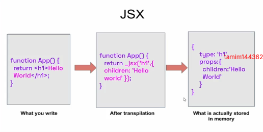

<h1 align="center">React Notes</h1>

<h4>Table of Contents</h4>


- [Introduction](#introduction)
    - [the story of react:](#the-story-of-react)
    - [what is components:](#what-is-components)
    - [what is virtual DOM and How virtual dom work:](#what-is-virtual-dom-and-how-virtual-dom-work)
    - [library vs framework](#library-vs-framework)
    - [react vs next vs vue](#react-vs-next-vs-vue)
    - [Create React App with Vite:](#create-react-app-with-vite)
    - [what is jsx and how jsx works](#what-is-jsx-and-how-jsx-works)


# Introduction

React is a component-based JavaScript frontend library developed by Facebook for building dynamic and interactive user interfaces, especially for single-page applications. It allows developers to create reusable UI components with efficiently update the DOM using a virtual DOM.

### the story of react:

Back in the early 2010s, Facebook engineers were in trouble. Their web applications, especially the news feed and the ads system, needed frequent updates. Every little change meant updating the real DOM directly — and that was slow, clunky, and full of bugs. The UI became harder to manage, and performance dropped.

In 2011, one Facebook engineer, Jordan Walke, decided to experiment. He built a prototype called FaxJS. The idea was bold: instead of updating the DOM directly, create a Virtual DOM — a lightweight copy of the actual DOM. Whenever something changed, compare the new Virtual DOM with the old one, and then update only the parts that actually changed in the real DOM. The results were stunning. Suddenly, apps ran smoother and faster.

By 2012, this new approach was powering Facebook Ads, and later, Instagram. The success inside Facebook was undeniable.

Then came 2013. At JSConf US, Facebook decided to release this tool to the world. At first, developers didn’t know what to make of it. JSX — writing HTML inside JavaScript — looked strange. Some argued it broke the rules of traditional MVC (is a design pattern that separates an application into three parts: model, view, controller) patterns. A few even called it “the worst idea ever.”

But React had a secret weapon: it worked.

By 2014, people started noticing that React apps were faster, more predictable, and easier to maintain. The component-based architecture encouraged reuse, and teams could build complex interfaces without drowning in spaghetti code.

Then came 2015, a breakthrough year. Big companies like Netflix adopted React. The state management library Redux was released, solving complex data flow issues. React Native made it possible to use the same principles to build mobile apps for iOS and Android. Even developer tools like the React DevTools browser extension were launched, making debugging easier. React was no longer just a Facebook experiment — it was becoming the industry standard.

Over the following years, React kept evolving. Updates brought new features, performance boosts, and better developer experience. One of the biggest shifts came with Hooks (like useState, useEffect, and useContext). With Hooks, developers no longer needed class components for state and lifecycle management. Functional components became powerful and simple, and writing React apps became cleaner than ever.

From a hack at Facebook to a global phenomenon, React completely changed the way we think about building user interfaces. Today, React powers not only web applications but also mobile apps (React Native), desktop apps, and even experiments in VR.

### what is components:
A component is basically a reusable, independent piece of UI. Components can be small (like a button) or large (like a whole form or page).


### what is virtual DOM and How virtual dom work:
The Virtual DOM is a lightweight, in-memory copy of the real DOM.


**How virtual dom work**
Here, we have a component that has a `<div>` and inside the `<div>` two elements:
- First, React creates a Virtual DOM for this component, based on the actual DOM.
- Then, when we change something—like adding a new `<h3>` element—React creates a new Virtual DOM for the updated component.
- Next, React compares the newly created Virtual DOM with the previous Virtual DOM. This process is called diffing.
- After comparing, React updates only the parts of the real DOM that changed in the actual DOM. This process is called reconciliation.


### library vs framework

- library: A library is a collection of pre-written code that developers can call whenever they need it. You are in control of the flow, and you decide when and how to use the library.
- framework: A framework is a complete structure for building applications. It dictates the flow of your application and provides predefined ways to do things. You must follow the framework’s rules.
  

- library: yo cal the library, means you decide when and how to use it.
- framework: the framework cal you, means it decide when and how to use it.


- library: more flexible, you can combine with others tolls
- framework: less flexible, you must follow its rules and conventions


- library: focus on specific task
- framework: provides a full solution for building entire apps


### react vs next vs vue

|              | React                                  | Next.js                                                       | Vue.js                                       |
| ------------ | -------------------------------------- | ------------------------------------------------------------- | -------------------------------------------- |
| Type         | UI Library                             | Full-stack React Framework                                    | Progressive Framework                        |
| Developed by | Facebook                               | Vercel                                                        | Evan You (ex-Google)                         |
| Purpose      | Build UI components (Frontend only)    | Build full-stack web apps                                     | Build frontend apps; full-stack with Nuxt.js |
| Rendering    | Client-Side Rendering (CSR) by default | Supports CSR, SSR, SSG, ISR (Incremental Static Regeneration) | CSR by default; SSR available with Nuxt.js   |
| Flexibility  | Very flexible                          | less flexible                                                 | Balanced                                     |
| Performance  | Good, but CSR-only may affect SEO      | Excellent (SSR, SSG make it SEO-friendly & fast)              | Good (Nuxt adds performance benefits)        |
| Routing      | using react router or others libraries | Built-in file based                                           | built-in                                     |
| Best For     | Single page apps                       | SEO focused large scale apps                                  | single page to medium apps                   |

### Create React App with Vite:

Vite is a modern build tool that offers lightning-fast startup and optimized development experience for React and other frameworks.

**Step 1: Create React App with Vite** 
```bash
npm create vite@latest project-name -- --template react
```

**Step 2:  Install Dependencies**

```bash
cd my-react-app
npm i tailwindcss @tailwindcss/vite -D daisyui@latest
```

**Step 3: run you project on vs code**

```js
code .
```

**step 4: setup tailwind and daisyui:**

vite.config.js:

```js
import { defineConfig } from 'vite'
import react from '@vitejs/plugin-react'
import tailwindcss from '@tailwindcss/vite'

// https://vite.dev/config/
export default defineConfig({
  plugins: [react(), tailwindcss()],
})
```

Import Tailwind CSS and daisyUi to index.css:

```js
@import "tailwindcss";
@plugin "daisyui";
```

**step 5: Run the development server:**

```bash
npm run dev
```


### what is jsx and how jsx works

JSX stands for JavaScript XML, and it is a special syntax used in React to simplify building user interfaces. JSX allows you to write HTML-like code directly inside JavaScript, enabling you to create UI components more efficiently.


Example:

```jsx
// app.jsx
import React from 'react';

const App = () => {
  return (
    <div>
      <h1>Hello World</h1>
    </div>
  );
};

export default App;
```
`<h1>Hello, world!</h1>` is a JSX element, similar to HTML, that represents a heading tag. JSX is converted into JavaScript behind the scenes, where React uses React.createElement() to turn the JSX code into actual HTML elements that the browser can understand.


When React processes this JSX code, it converts it into JavaScript using Babel. This JavaScript code then creates real HTML elements in the browser’s DOM . which is how your web page gets displayed.



**Note:** Babel acts as a translator for your React code. It takes modern JavaScript (like JSX) that browsers don't understand directly. Finally, it converts it into older, compatible JavaScript so your application runs everywhere.