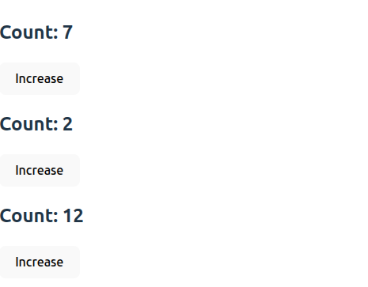
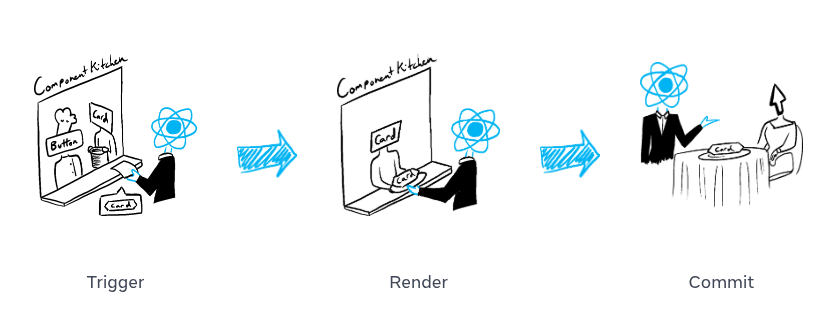

<h1 align="center">React Notes</h1>


- [Setup:](#setup)
- [Feature based folder structure:](#feature-based-folder-structure)
    - [Naming Conventions:](#naming-conventions)
- [Introduction](#introduction)
    - [The story of react:](#the-story-of-react)
    - [what is components:](#what-is-components)
    - [what is virtual DOM and How virtual dom work:](#what-is-virtual-dom-and-how-virtual-dom-work)
    - [library vs framework](#library-vs-framework)
    - [react vs next vs vue](#react-vs-next-vs-vue)
    - [Inside the Vite + react:](#inside-the-vite--react)
- [jsx](#jsx)
    - [How JSX Works behind the scenes:](#how-jsx-works-behind-the-scenes)
    - [JSX rules:](#jsx-rules)
- [conditional rendering](#conditional-rendering)
- [Rendering list in react](#rendering-list-in-react)
- [Passing Data using Props, callback function, context api and Outlet](#passing-data-using-props-callback-function-context-api-and-outlet)
    - [props](#props)
    - [Callback Functions:](#callback-functions)
    - [Context API](#context-api)
    - [Outlet](#outlet)
    - [what is the difference between props, callback function and context api](#what-is-the-difference-between-props-callback-function-and-context-api)
- [Event Handling in react](#event-handling-in-react)
- [useState()](#usestate)
    - [How useState works behind the scenes:](#how-usestate-works-behind-the-scenes)
    - [Batching Updates and Functional Updates:](#batching-updates-and-functional-updates)
    - [State is isolated and private](#state-is-isolated-and-private)
    - [Structuring State:](#structuring-state)
    - [Lifting state up](#lifting-state-up)
- [data loading in react](#data-loading-in-react)
    - [using use() with suspense:](#using-use-with-suspense)
    - [using use with no-suspense:](#using-use-with-no-suspense)
    - [using useEffect()](#using-useeffect)
    - [Infinite api call issue:](#infinite-api-call-issue)
- [react component lifecycle](#react-component-lifecycle)
- [useEffect](#useeffect)
- [Pure and InPure function](#pure-and-inpure-function)
- [Screen Updates in React](#screen-updates-in-react)
    - [Step 1: Trigger a Render](#step-1-trigger-a-render)
      - [Initial Render](#initial-render)
      - [Re-render:](#re-render)
    - [Step 2: React Renders Your Components](#step-2-react-renders-your-components)
    - [Step 3: React Commits Changes to the DOM](#step-3-react-commits-changes-to-the-dom)
- [Forms](#forms)
    - [Controlled Component:](#controlled-component)
    - [Un-controlled Component:](#un-controlled-component)
    - [Accessing form data:](#accessing-form-data)
      - [Manual accessing:](#manual-accessing)
      - [Using formData():](#using-formdata)
- [Custom hook:](#custom-hook)
- [Others](#others)
    - [How to implement dynamic title:](#how-to-implement-dynamic-title)

---


# Setup:

Vite is a modern build tool that offers lightning-fast startup and optimized development experience for React and other frameworks.

**Step 1: Create React App with Vite** 
```bash
npm create vite@latest project-name -- --template react
```
For TS: 

```bash
npm create vite@latest project-name -- --template react-ts
```

**Step 2:  Install Dependencies**

```bash
npm i react-router tailwindcss @tailwindcss/vite -D daisyui@latest 
```

**step 3: setup tailwind and daisyui:**

vite.config.js:

```js
import { defineConfig } from 'vite'
import react from '@vitejs/plugin-react'
import tailwindcss from '@tailwindcss/vite'

export default defineConfig({
  plugins: [react(), tailwindcss()],
})
```

Import Tailwind CSS and daisyUi to index.css:

```js
@import "tailwindcss";
@plugin "daisyui";
```

**step 4: setup react router** 

main.jsx:

```jsx
import { StrictMode } from 'react'
import { createRoot } from 'react-dom/client';
import './index.css'
import { createBrowserRouter, RouterProvider } from 'react-router';


const router = createBrowserRouter([
  {
    path: '/',
    element: <h1>Welcome to the Home Page</h1>,
  },
])

createRoot(document.getElementById('root')).render(
  <StrictMode>
    <RouterProvider router={router}></RouterProvider>
  </StrictMode>,
)
```

**step 5: setup shadcn**

```
npm install -D @types/node
```

tsconfig.json:

```ts
{
  "files": [],
  "references": [
    {
      "path": "./tsconfig.app.json"
    },
    {
      "path": "./tsconfig.node.json"
    }
  ],
  "compilerOptions": {
    "baseUrl": ".",
    "paths": {
      "@/*": ["./src/*"]
    }
  }
}
```

tsconfig.app.json:

```ts
{
  "compilerOptions": {
    "baseUrl": ".",
    "paths": {
      "@/*": [
        "./src/*"
      ]
    },
    "tsBuildInfoFile": "./node_modules/.tmp/tsconfig.app.tsbuildinfo",
    "target": "ES2022",
    "useDefineForClassFields": true,
    "lib": [
      "ES2022",
      "DOM",
      "DOM.Iterable"
    ],
    "module": "ESNext",
    "types": [
      "vite/client"
    ],
    "skipLibCheck": true,
    /* Bundler mode */
    "moduleResolution": "bundler",
    "allowImportingTsExtensions": true,
    "verbatimModuleSyntax": true,
    "moduleDetection": "force",
    "noEmit": true,
    "jsx": "react-jsx",
    /* Linting */
    "strict": true,
    "noUnusedLocals": true,
    "noUnusedParameters": true,
    "erasableSyntaxOnly": true,
    "noFallthroughCasesInSwitch": true,
    "noUncheckedSideEffectImports": true
  },
  "include": [
    "src"
  ]
}
```

vite.config.ts:

```ts
import { defineConfig } from 'vite'
import react from '@vitejs/plugin-react'
import tailwindcss from '@tailwindcss/vite'
import path from "path"


export default defineConfig({
  plugins: [react(), tailwindcss()],
  resolve: {
    alias: {
      "@": path.resolve(__dirname, "./src"),
    },
  },
})
```

```
npx shadcn@latest init
```

components.json:

```
{
  "$schema": "https://ui.shadcn.com/schema.json",
  "style": "new-york",
  "rsc": false,
  "tsx": true,
  "tailwind": {
    "config": "",
    "css": "src/index.css",
    "baseColor": "neutral",
    "cssVariables": true,
    "prefix": ""
  },
  "iconLibrary": "lucide",
  "aliases": {
    "components": "@shared/components",
    "utils": "@shared/lib/utils",
    "ui": "@/shared/components/ui",
    "lib": "@/shared/lib",
    "hooks": "@/shared/hooks"
  },
  "registries": {}
}
```

---

# Feature based folder structure:

```
.
└── my-react-app/
    ├── src/
    │   ├── assets
    │   ├── core/
    │   │   ├── main.js
    │   │   ├── providers/
    │   │   │   ├── AppProvider.jsx
    │   │   │   ├── AuthProvider.jsx
    │   │   │   └── ThemeProvider.jsx
    │   │   ├── routes/
    │   │   │   ├── AppRoutes.jsx
    │   │   │   └── ProtectedRoute.jsx
    │   │   ├── layouts/
    │   │   │   ├── MainLayout.jsx
    │   │   │   ├── DashboardLayout.jsx
    │   │   │   └── AuthLayout.jsx
    │   │   └── hooks/
    │   │       ├── useAuth.js
    │   │       └── useTheme.js
    │   ├── features/
    │   │   ├── features-name /
    │   │   │   ├── components
    │   │   │   ├── pages
    │   │   │   ├── hooks
    │   │   │   ├── utils
    │   │   │   ├── context
    │   │   │   └── providers
    │   │   ├── users
    │   │   ├── products
    │   │   ├── dashboard
    │   │   ├── bookmarks
    │   │   ├── cart
    │   │   └── payment
    │   ├── pages/
    │   │   ├── HomePage.jsx
    │   │   ├── AboutPage.jsx
    │   │   ├── ContactPage.jsx
    │   │   ├── ErrorPage.jsx
    │   │   └── NotFoundPage.jsx
    │   ├── shared/
    │   │   ├── components/
    │   │   │   ├── ui
    │   │   │   └── structure/
    │   │   │       ├── Navbar.jsx
    │   │   │       ├── Footer.jsx
    │   │   │       └── Hero.jsx
    │   │   ├── hooks
    │   │   └── utils
    │   └── styles/
    │       └── index.css
    ├── .gitignore
    ├── eslint.config.js
    ├── index.html
    ├── package-lock.json
    ├── package.json
    ├── README.md
    └── vite.config.js
```

<!-- 

my-react-app
  node_modules
  public
  src
    assets
    core
      main.js
      providers
        AppProvider.jsx
        AuthProvider.jsx
        ThemeProvider.jsx
      routes
        routes.jsx
        ProtectedRoute.jsx
      layouts
        MainLayout.jsx
        DashboardLayout.jsx
        AuthLayout.jsx
      config 
        eng.local
      hooks
        useAuth.js
        useTheme.js
    features
      featues-name 
        components
        pages
        hooks
        utils
        context
        providers
      users
      products
      dashboard
      bookmarks
      cart
      payment
    pages
      HomePage.jsx
      AboutPage.jsx
      ContactPage.jsx
      ErrorPage.jsx
      NotFoundPage.jsx
    shared
      components
        ui
        structure
          Navbar.jsx
          Footer.jsx
          Hero.jsx
      hooks
      utils
    styles
      index.css
      
      
  
  .gitignore
  eslint.config.js
  index.html
  package-lock.json
  package.json
  README.md
  vite.config.js
 -->

**Note:**

- state + API + UI logic → it’s a feature.
- static or purely layout/navigation → it’s a page.
- reused everywhere → it goes under shared/.

### Naming Conventions: 

- General Folder Names - one words & lowercase - components, pages, layouts, hooks, utils etc.
- React Component Folders & Files - PascalCase - Navbar/Navbar.jsx, Footer/Footer.jsx, Hero/Hero.jsx
- Non-Components (context or any js files(utils, hooks, services,)) - camelCase - AuthContext.jsx, formatDate.js, useAuth.js, authService.js
- assets files name - kebab-case - hero-banner.png 

# Introduction

React is a component-based JavaScript frontend library developed by Facebook for building dynamic and interactive user interfaces, especially for single-page applications. It allows developers to create reusable UI components with efficiently update the DOM using a virtual DOM.

### The story of react:

Back in the early 2010s, Facebook engineers were in trouble. Their web applications, especially the news feed and the ads system, needed frequent updates. Every little change meant updating the real DOM directly — and that was slow, clunky, and full of bugs. The UI became harder to manage, and performance dropped.

In 2011, one Facebook engineer, Jordan Walke, decided to experiment. He built a prototype called FaxJS. The idea was bold: instead of updating the DOM directly, create a Virtual DOM — a lightweight copy of the actual DOM. Whenever something changed, compare the new Virtual DOM with the old one, and then update only the parts that actually changed in the real DOM. The results were stunning. Suddenly, apps ran smoother and faster.

By 2012, this new approach was powering Facebook news feeds and Ads, and later, Instagram. The success inside Facebook was undeniable.

Then came 2013. At JSConf US, Facebook decided to release this tool to the world. At first, developers didn’t know what to make of it. JSX — writing HTML inside JavaScript — looked strange. Some argued it broke the rules of traditional MVC (is a design pattern that separates an application into three parts: model, view, controller) patterns. A few even called it “the worst idea ever.”

By 2014, people started noticing that React apps were faster, more predictable, and easier to maintain. The component-based architecture encouraged reuse, and teams could build complex interfaces without drowning in spaghetti code.

Then came 2015, a breakthrough year. Big companies like Netflix, airBnb adopted React. The state management library Redux was released, solving complex data flow issues. React Native made it possible to use the same principles to build mobile apps for iOS and Android. Even developer tools like the React DevTools browser extension were launched, making debugging easier. React was no longer just a Facebook experiment — it was becoming the industry standard.

Over the following years, React kept evolving. Updates brought new features, performance boosts, and better developer experience. One of the biggest shifts came with Hooks (like useState, useEffect, and useContext). With Hooks, developers no longer needed class components for state and lifecycle management. Functional components became powerful and simple, and writing React apps became cleaner than ever.

From a hack at Facebook to a global phenomenon, React completely changed the way we think about building user interfaces. Today, React powers not only web applications but also mobile apps (React Native), desktop apps, and even experiments in VR.

### what is components:
A component is basically a reusable, independent piece of UI. Components can be small (like a button) or large (like a whole form or page).


here, Here is a Gallery component rendering three Profile components:

```jsx
import React from 'react';
import Gallery from './Gallery';

const App = () => {
  return (
    <div>
      <Gallery></Gallery>
    </div>
  );
};

export default App;
```

```jsx
import React from 'react';
import Profile from './Profile';

const Gallery = () => {
    return (
        <div>
            <h1>Amazing scientists</h1>
            <Profile></Profile>
            <Profile></Profile>
            <Profile></Profile>
        </div>
    );
};

export default Gallery;
```

```jsx
import React from 'react';

const Profile = () => {
    return (
        <div>
            
        </div>
    );
};

export default Profile;
```

### what is virtual DOM and How virtual dom work:
The Virtual DOM is a lightweight, in-memory copy of the real DOM.


Here, we have a component that has a `<div>` and inside the `<div>` two elements:
- First, React creates a Virtual DOM for this component, based on the actual DOM.
- Then, when we change something—like adding a new `<h3>` element—React creates a new Virtual DOM for the updated component.
- Next, React compares the newly created Virtual DOM with the previous Virtual DOM. This process is called diffing.
- After comparing, React updates only the parts of the real DOM that changed. This process is called reconciliation.


### library vs framework


| library                                                                                                                                                  | framework                                                                                                                             |
| -------------------------------------------------------------------------------------------------------------------------------------------------------- | ------------------------------------------------------------------------------------------------------------------------------------- |
| A library is a collection of pre-written code that you can pick and use whenever you need. You decide when to call it and how to use it in your program. | A framework is a pre-defined structure that you must follow to build your application. It decides when your code runs and how to use. |
| you cal the library, means you decide when and how to use it.                                                                                            | the framework cal you, means it decide when and how to use it.                                                                        |
| more flexible, you can combine with others tolls                                                                                                         | less flexible, you must follow its rules and conventions                                                                              |
| focus on specific task                                                                                                                                   | provides a full solution for building entire apps                                                                                     |

### react vs next vs vue

|              | React                                  | Next.js                                                       | Vue.js                                       |
| ------------ | -------------------------------------- | ------------------------------------------------------------- | -------------------------------------------- |
| Type         | UI Library                             | Full-stack React Framework                                    | Progressive Framework                        |
| Developed by | Facebook                               | Vercel                                                        | Evan You (ex-Google)                         |
| Purpose      | Build UI components (Frontend only)    | Build full-stack web apps                                     | Build frontend apps; full-stack with Nuxt.js |
| Rendering    | Client-Side Rendering (CSR) by default | Supports CSR, SSR, SSG, ISR (Incremental Static Regeneration) | CSR by default; SSR available with Nuxt.js   |
| Flexibility  | Very flexible                          | less flexible                                                 | Balanced                                     |
| Performance  | Good, but CSR-only may affect SEO      | Excellent (SSR, SSG make it SEO-friendly & fast)              | Good (Nuxt adds performance benefits)        |
| Routing      | using react router or others libraries | Built-in file based                                           | built-in                                     |
| Best For     | Single page apps                       | SEO focused large scale apps                                  | single page to medium apps                   |


### Inside the Vite + react: 

- index.html: Root HTML file for the react app.
  - `<div id="root"></div>` → This is where React mounts the entire application.
  - `<script type="module" src="/src/main.jsx"></script>` → Loads main.jsx, the starting point of your React app.

```html
<!doctype html>
<html lang="en">
  <head>
    <meta charset="UTF-8" />
    <link rel="icon" type="image/svg+xml" href="/vite.svg" />
    <meta name="viewport" content="width=device-width, initial-scale=1.0" />
    <title>Vite + React</title>
  </head>
  <body>
    <div id="root"></div>
    <script type="module" src="/src/main.jsx"></script>
  </body>
</html>
``` 

- main.jsx: Entry point for the React app. it select the root element form the index.html and render all the component there by using react DOM.
  - `<StrictMode>` → helps catch potential problems in development.

```jsx
import { StrictMode } from 'react'
import { createRoot } from 'react-dom/client'
import './index.css'
import App from './App.jsx'

createRoot(document.getElementById('root')).render(
  <StrictMode>
    <App />
  </StrictMode>,
)
```

- App.jsx: A React component, You can have thousands of components like this, but they all must be imported and connected in a component tree.
```jsx
import './App.css'

function App() {

  return (
    <>
      <h1>I am h1, created from React but in JSX</h1>
    </>
  )
}

export default App
```

# jsx

JSX stands for JavaScript XML. JSX allows you to write HTML directly inside JavaScript, enabling you to create UI components more efficiently.


### How JSX Works behind the scenes:

When we use React, it attaches two global objects to the browser:

1. React → The core React library.
   - Contains APIs like createElement, useState, useEffect, etc.
   - These functions don’t directly render to the browser; instead, they create and manage React elements (plain JavaScript objects that describe the UI).

2. ReactDOM → The library that connects React with the browser DOM.
   - Provides methods like createRoot and render.
   - It takes React elements (from React) and actually updates the real DOM on the screen.


```jsx
<!DOCTYPE html>
<html lang="en">

<head>
    <meta charset="UTF-8">
    <meta name="viewport" content="width=device-width, initial-scale=1.0">
    <title>Document</title>
    <!-- react CDN -->
    <script crossorigin src="https://unpkg.com/react@18/umd/react.development.js"></script>
    <script crossorigin src="https://unpkg.com/react-dom@18/umd/react-dom.development.js"></script>
</head>

<body>

    <script>
        console.log(React)
        console.log(ReactDOM)
    </script>
</body>

</html>
```


Note: This is just for demo purposes. In modern React projects, we don’t write code like this. Instead, we use JSX along with tools like Vite, CRA, or Next.js, which install all React packages behind the scenes.


**Creating an Element with React (Without JSX):**
In React’s early days (or when using React via a CDN), we can manually create elements like this:

```html
<!DOCTYPE html>
<html lang="en">

<head>
  <meta charset="UTF-8">
  <title>React Example</title>
  <!-- React CDN -->
  <script crossorigin src="https://unpkg.com/react@18/umd/react.development.js"></script>
  <script crossorigin src="https://unpkg.com/react-dom@18/umd/react-dom.development.js"></script>
</head>

<body>
  <!-- Root container where React will render -->
  <div id="root"></div>

  <script>
    // Create a React element: (type, props, children)
    const myElement = React.createElement("h1", null, "I am h1, created from React");

    console.log(myElement); // logs a plain object describing the UI

    // Render it to the DOM
    const root = ReactDOM.createRoot(document.getElementById("root"));
    root.render(myElement);
  </script>
</body>

</html>
```
What myElement looks like in the console:


This shows that a React element is just a JavaScript object.

**Creating an Element with JSX and Babel:**

In real projects (with Vite, CRA, Next.js, etc.), we don’t usually write React.createElement. Instead, we use JSX, which looks like this:

```jsx
import './App.css'

function App() {

  return (
    <>
      <h1>I am h1, created from React but in JSX</h1>
    </>
  )
}

export default App
```
However, browsers cannot understand JSX directly. That’s where Babel comes in. behind the scenes Babel compiles it into React.createElement:

```jsx
function App() {
  return React.createElement("h1", null, "I am h1, created from React but in JSX");
}
```
Which produces the same object as before:


Then, ReactDOM takes that object and updates the real DOM.

For Better understand how babel works, below we directly used babel.js: 

```html
<!DOCTYPE html>
<html lang="en">

<head>
    <meta charset="UTF-8">
    <meta name="viewport" content="width=device-width, initial-scale=1.0">
    <title>Document</title>
    <!-- react CDN -->
    <script crossorigin src="https://unpkg.com/react@18/umd/react.development.js"></script>
    <script crossorigin src="https://unpkg.com/react-dom@18/umd/react-dom.development.js"></script>
    <!-- babel.js CDN -->
    <script src="https://unpkg.com/@babel/standalone/babel.min.js"></script>

</head>

<body>

    <!-- a root div where, react element will render -->
    <div id="root"></div>

    <script type="text/babel">
        // const myElement = React.createElement("h1", null, "I am jsx h1, created from js using Babel.js");
        const myElement = <h1>I am jsx h1, created from js using Babel.js</h1>
        const root = ReactDOM.createRoot(document.getElementById("root"));
        root.render(myElement);
    </script>
</body>

</html>
```

### JSX rules: 

- You have include JavaScript expressions using { }: 

```jsx
import React from 'react';

const App = () => {
  const name = "Tamim";
  return (
    <div>
      <h1>hello, i'm {name}.</h1>
    </div>
  );
};

export default App;
```

- JSX attributes are written camelCase (class = className, onclick = onClick)

```jsx
import React from 'react';

const App = () => {
  const name = "Tamim";
  const handleClick = () => {
    console.log("Hello world")
  }
  return (
    <div>
      <h1 className='text-2xl font-black text-red-100'>hello, i'm {name}.</h1>
      <button onClick={handleClick()}>click</button>
    </div>
  );
};

export default App; 
```

- css styles are written as objects.

```jsx
import React from 'react';

const App = () => {
  const stylesObject = {
    color: "blue",
    fontSize: "20px"
  }

  return (
    <div>
      <h1 style={{ color: "blue", fontSize: "20px" }}>Hello, i'm Tamim.</h1>
      <h1 style={stylesObject}>Hello, i'm Tamim.</h1>
      <h1 className='stylesComeFormCSSFile'>Hello, i'm Tamim</h1>
    </div>
  );
};

export default App;
```

- JSX Must Return a Single Parent:

Wrong: 

```jsx
import React from 'react';

const App = () => {

  return (
    <h1>Hello</h1>
    <p>World</p>
  );
};

export default App;
``` 

right: 

```jsx
import React from 'react';

const App = () => {

  return (
    <div>
      <h1>Hello</h1>
      <p>World</p>
    </div>
  );
};

export default App;
```

or use fragment:

```jsx
import React from 'react';

const App = () => {

  return (
    <>
      <h1>Hello</h1>
      <p>World</p>
    </>
  );
};

export default App;
```

- When rendering lists, each item must have a unique key: 

```jsx
import React from 'react';

const App = () => {

  const items = ["Apple", "Banana", "Mango"];

  return (
    <ul>
      {items.map((item, index) => (
        <li key={index}>{item}</li>
      ))}
    </ul>
  );
}

export default App;
```

---

# conditional rendering

- using if-ele statement: 

```jsx
import React from 'react';

const App = () => {

  const isLoggedIn = true;

  if (isLoggedIn) {
    return <h1>Welcome, back, User!</h1>
  }
  else {
    return <h1>Please login</h1>
  }
};

export default App;
``` 

- using ternary operator: 

```jsx
import React from 'react';

const App = () => {

  const isLoggedIn = true;
  return (
    <div>
      {isLoggedIn ? "Welcome, back, User!" : "Please login"}
    </div>
  )
};

export default App;
```

- using logical AND (&&) and OR (||)

```jsx
import React from 'react';

const App = () => {

  const isLoggedIn = true;
  return (
    <div>
      {isLoggedIn && "Welcome, back, User!"}
      {isLoggedIn || "Please Login"}
    </div>
  )
};

export default App;
``` 
---

# Rendering list in react

In React, rendering a list means showing each element of an array using JSX and the map() method.

We cannot use other methods like forEach and loops like for loop, or for..of here, because React needs to return a new array, and none of them return a new array. That’s why we need to use map() for rendering lists in React.

```jsx
import React from 'react';

const App = () => {
  const users = [
    { id: 1, name: "Tamim", age: 21 },
    { id: 2, name: "Sara", age: 19 },
    { id: 3, name: "John", age: 25 }
  ];

  return (
    <ul>
      {users.map((user) => (
        <li key={user.id}>
          {user.name} ({user.age} years old)
        </li>
      ))}
    </ul>
  );
};

export default App;
```

Here, we also need unique keys for list rendering because the key prop helps React identify which items are changed, added, or removed. If we don’t use keys and change something in the array, React will re-render the whole list again and cannot track the elements properly.


Also sometimes we use index as a key, but it’s not recommended. Even if you don’t see any error when using index as a key but React may get confused when we try operations like adding, removing, or updating items. Use index only when you are 100% sure the array will never change.

```jsx
import React from 'react';

const App = () => {
  const fruits = ["Apple", "Banana", "Mango"];

  return (
    <div>
      <ul>
        {fruits.map((fruit, index) => (
          <li key={index}>{fruit}</li>
        ))}
      </ul>
    </div>
  );

};

export default App;
```
---

# Passing Data using Props, callback function, context api and Outlet

### props

Props are used to pass data from a parent component to a child component in React. props are read-only means a child cannot modify the props. 

Note: props is received as an object

```jsx
import React from 'react';

const App = () => {
  return (
    <div>
      <UserInfo name="Tamim" age="20" country="BD"></UserInfo>
    </div>
  );
};

export default App;

const UserInfo = (props) => {
  console.log(props) // {name: 'Tamim', age: '20', country: 'BD'}

  return (
    <h1>Hello</h1>
  )
}
```

- **Passing Multiple Props:**

```jsx
import React from 'react';

const App = () => {
  return (
    <div>
      <UserInfo name="Tamim" age="20" country="BD"></UserInfo>
    </div>
  );
};

export default App;

const UserInfo = (props) => {
  return (
    <div>
      <h1>Name: {props.name}</h1>
      <h1>Age: {props.age}</h1>
      <h1>Country: {props.country}</h1>
    </div>
  )
}
```

- **Destructuring props:**

Instead of writing props.name, props.age, etc., you can use destructuring.

```jsx
import React from 'react';

const App = () => {
  return (
    <div>
      <UserInfo name="Tamim" age="20" country="BD"></UserInfo>
    </div>
  );
};

export default App;

const UserInfo = ({ name, age, country }) => {

  return (
    <div>
      <h1>Name: {name}</h1>
      <h1>Age: {age}</h1>
      <h1>Country: {country}</h1>
    </div>
  )
}
```

- **Default Props:**

If a prop is not passed, you can set a default value.

```js
import React from 'react';

const App = () => {
  return (
    <div>
      <UserInfo name="Tamim" age="20" country="BD"></UserInfo>
    </div>
  );
};

export default App;

const UserInfo = ({ name, age, country, single = "Yes" }) => {

  return (
    <div>
      <h1>Name: {name}</h1>
      <h1>Age: {age}</h1>
      <h1>Country: {country}</h1>
      <h1>Single: {single}</h1>
    </div>
  )
}
```

- **Props Can Be Any Data Type:**

```jsx
import React from 'react';

const App = () => {
  const info = {
    name: "tamim",
    age: 20,
    country: "BD"
  }

  const crushList = ["tasnim", "liya", "bithe"]

  const alertShow = () => {
    alert("Hello props world")
  }

  return (
    <div>
      <ShowUserInfo info={info} single={true} hobby="Playing football" crushList={crushList} alertShow={alertShow}></ShowUserInfo>
    </div>
  );
};

export default App;

const ShowUserInfo = ({ info, single, hobby, crushList, alertShow }) => {

  const { name, age, country } = info;

  return (
    <div>
      <h1>Name: {name}</h1>
      <h1>Age: {age}</h1>
      <h1>Country: {country}</h1>
      <h1>alone: {single ? "I'm alone" : "i'm not alone"}</h1>
      <h1>Hobby: {hobby}</h1>

      <ul>
        {crushList.map((girls, index) =>
          <li key={index}>{girls}</li>
        )}
      </ul >

      <div>
        <button className='btn' onClick={alertShow}>click</button>
      </div>
    </div>
  )
}
```

- **Children Prop (props.children):**

In React, children is a special prop that lets you pass content inside a component.


example 1: 

```jsx
import React from 'react';

const App = () => {
  return (
    <Card>
      <h2>This is inside the Card component</h2>
      <p>Reusable component with children props</p>
    </Card>
  );
};

export default App;

function Card({ children }) {
  return <div className="card">{children}</div>;
}
```

example 2: 

```jsx
import React from "react";
import AlertButton from "./AlertButton";

const App = () => {
  return (
    <div>
      <AlertButton message="playing">
        <p>Click me to playing</p>
      </AlertButton>
      <AlertButton message="dancing">
        <p>Click me to dancing</p>
      </AlertButton>
    </div>
  );
}

export default App;
```

```jsx
import React from 'react';

const AlertButton = ({ message, children }) => {
    return (
        <button onClick={() => alert(message)}>
            {children}
        </button>
    );
};

export default AlertButton;
```

Example 3: 

```jsx
import React from "react";
import PlayButton from "./PlayButton";
import UploadButton from "./UploadButton";

const App = () => {
  return (
    <div>
      <PlayButton movieName={"Titanic"}></PlayButton>
      <UploadButton></UploadButton>
    </div>
  );
}

export default App;
```

```jsx
import React from 'react';
import Button from './Button';

const PlayButton = ({ movieName }) => {

    const handlePlayClick = () => {
        alert(`playing ${movieName}`);
    }

    return (
        <div>
            <Button onClick={handlePlayClick}>
                <p>Play {movieName}</p>
            </Button>
        </div>
    );
};

export default PlayButton;
```

```jsx
import React from 'react';
import Button from './Button';

const UploadButton = () => {
    return (
        <div>
            <Button onClick={() => alert("Uploaded")}>
                <p>Upload Your movie</p>
            </Button>
        </div>
    );
};

export default UploadButton;    
```

```jsx
import React from 'react';

const Button = ({ onClick, children }) => {
    return (
        <button onClick={onClick}>
            {children}
        </button>
    );
};

export default Button
```

### Callback Functions:
Props can only pass data from parent to child. But sometimes, the child component needs to send data back to the parent. In such cases, A callback function a callback function helps us to passing data from Child to Parent in React.

```jsx
import React, { useState } from 'react';

const App = () => {
  const [message, setMessage] = useState("");

  function handleChildData(data) {
    setMessage(data)
  }

  return (
    <div>
      <h1>Message form child: {message}</h1>
      <Child handleChildData={handleChildData}></Child>
    </div>
  );
};

export default App;

const Child = ({ handleChildData }) => {
  return (
    <div>
      <input className='input' onChange={(e) => handleChildData(e.target.value)} type="text" />
    </div>
  )
}
```

### Context API
The Context API in React is a built-in feature that allows you to share data across multiple components without having to pass props manually at every level. It helps avoid “prop drilling” by creating a global context that any component can access directly.

**How to create context API:**

step 1: Create Context

```jsx
// src > MyContext.jsx

import React from 'react';

const MyContext = React.createContext();

export default MyContext;
```

step 2: Provide Context Value 

```jsx
// src > main.jsx

import { StrictMode } from 'react'
import { createRoot } from 'react-dom/client'
import './index.css'
import App from './App.jsx'
import MyContext from './MyContext.jsx'


const user = { name: "Tamim", age: 20 };

createRoot(document.getElementById('root')).render(
  <StrictMode>
    <MyContext.Provider value={user}>
      <App />
    </MyContext.Provider>
  </StrictMode>,
)   
```

step 3: use context value using useContext():

```jsx
import React, { useContext } from 'react';
import MyContext from './MyContext';

const App = () => {
  const user = useContext(MyContext);
  const { name, age } = user;
  return (
    <div>
      <h1>Hello, my name is: {name}</h1>
      <p>I am {age} years old</p>
    </div>
  );
};

export default App;
```

example: 

```jsx
// Context.js
import { createContext } from "react";

const Context = createContext()

export default Context;
```

```jsx
// UserProvide.jsx
import React, { useState } from 'react';
import Context from './Context';

const UserProvider = ({ children }) => {
    const [user, setUser] = useState({
        name: "Tamim",
        email: "tamim@example.com",
        role: "Frontend Developer",
    });

    const logout = () => setUser(null);


    return (
        <Context.Provider value={{ user, logout }}>
            {children}
        </Context.Provider>
    );
};

export default UserProvider;
```

```jsx
// App.jsx
import React from 'react';
import UserProvider from './components/UserProvider';
import Layout from './Layout';

const App = () => {
  return (
    <div>
      <UserProvider>
        <Layout></Layout>
      </UserProvider>
    </div>
  );
};

export default App;
```

```jsx
// Layout.jsx
import React from 'react';
import Sidebar from './components/Sidebar';

const Layout = () => {
    return (
        <div className="p-4 border-2 border-blue-400 rounded">
            <h2>Layout Component</h2>
            <Sidebar />
        </div>

    );
};

export default Layout; 
```

```jsx
// Sidebar.jsx
import React from 'react';
import UserPanel from './UserPanel';

const Sidebar = () => {
    return (
        <div className="p-4 border-2 border-green-400 rounded mt-2">
            <h3>Sidebar Component</h3>
            <UserPanel />
        </div>
    );
};

export default Sidebar;
``` 

```jsx
// UserPanel.jsx
import React from 'react';
import UserDetails from './UserDetails';

const UserPanel = () => {
    return (
        <div className="p-4 border-2 border-yellow-400 rounded mt-2">
            <h4>UserPanel Component</h4>
            <UserDetails />
        </div>
    );
};

export default UserPanel;
```

```jsx
// UserDetails.jsx
import React, { use, useContext } from 'react';
import Context from './Context';

const UserDetails = () => {
    // const { user, logout } = useContext(Context); // traditional and most common, Works only for reading Context
    const { user, logout } = use(Context) // new hook that work with both Reading Context values and Suspense JSON response 
    if (!user) return <p>User logged out.</p>;
    return (
        <div className="p-4 border-2 border-red-400 rounded mt-2">
            <h5>UserDetails Component</h5>
            <p><strong>Name:</strong> {user.name}</p>
            <p><strong>Email:</strong> {user.email}</p>
            <p><strong>Role:</strong> {user.role}</p>
            <button
                onClick={logout}
                className="btn btn-error"
            >
                Logout
            </button>
        </div>
    );
};

export default UserDetails;
```

example 2: 

```jsx
// Context.js
import { createContext } from "react";

export const AuthContext = createContext(null);
export const ThemeContext = createContext(null);
```

```jsx
// App.jsx
import React, { useState } from "react";
import Layout from "./Layout";
import { AuthContext, ThemeContext } from "./components/Context";

const App = () => {
  // Auth state
  const [user, setUser] = useState({ name: "Tamim", role: "Developer" });

  // Theme state
  const [theme, setTheme] = useState("light");

  const logout = () => setUser(null);
  const toggleTheme = () => setTheme((previousValue) => (previousValue === "light" ? "dark" : "light"));

  return (
    <AuthContext.Provider value={{ user, logout }}>
      <ThemeContext.Provider value={{ theme, toggleTheme }}>
        <Layout />
      </ThemeContext.Provider>
    </AuthContext.Provider>
  );
};

export default App;
```

```jsx
// Layout.jsx
import React, { useContext } from "react";
import Header from "./components/Header";
import { ThemeContext } from "./components/Context";

const Layout = () => {
    const { theme } = useContext(ThemeContext);

    // Apply theme globally
    const layoutStyle =
        theme === "light"
            ? "min-h-screen bg-white text-black"
            : "min-h-screen bg-gray-900 text-white";

    return (
        <div className={layoutStyle}>
            <Header />
            <main className="p-4">
                <h1 className="text-2xl font-semibold">
                    Welcome to the nested context example!
                </h1>
            </main>
        </div>
    );
};

export default Layout;
```

```jsx
// Header.jsx
import React from "react";
import Navbar from "./Navbar";

const Header = () => {
    return (
        <header className="border-b pb-2">
            <Navbar />
        </header>
    );
};

export default Header;
```

```jsx
// Navbar.jsx
import React from "react";
import UserPanel from "./UserPanel";

const Navbar = () => {
    return (
        <nav className="flex justify-between items-center">
            <h1 className="font-bold text-xl">My App</h1>
            <UserPanel />
        </nav>
    );
};

export default Navbar;
```

```jsx
// UserPanel.jsx
import React, { useContext } from "react";
import { AuthContext, ThemeContext } from "./Context";

const UserPanel = () => {
    const { user, logout } = useContext(AuthContext);  // from AuthContext
    const { theme, toggleTheme } = useContext(ThemeContext);  // from ThemeContext

    console.log(theme)


    return (
        <div >
            {user ? (
                <>
                    <p>
                        👤 {user.name} ({user.role})
                    </p>
                    <button
                        className="bg-red-500 text-white px-2 py-1 rounded mt-1"
                        onClick={logout}
                    >
                        Logout
                    </button>
                </>
            ) : (
                <p>Please log in</p>
            )}

            <button className="btn btn-primary" onClick={toggleTheme}>
                Toggle Theme
            </button>
        </div>
    );
};

export default UserPanel;
```

### Outlet

Outlet has a builtin context feature, we can pass data using this context and received data using useOutletContext() hook.

```jsx
<Outlet context={{ test }} />
```

```jsx
import { useOutletContext } from 'react-router-dom';

const ListedBooksPage = () => {
  const { test } = useOutletContext();
  console.log(test); 
}
```

### what is the difference between props, callback function and context api

props: parent --> child
callback function: child --> parent
context api: Global (anywhere in tree)

---

# Event Handling in react

- Passing Functions and Arguments as Event Handlers

```jsx
import { useState } from 'react'
import reactLogo from './assets/react.svg'
import viteLogo from '/vite.svg'
import './App.css'

function App() {
  const handleClick1 = () => {
    alert("I am clicked1");
  }

  const handleClick2 = () => {
    alert("I am clicked2");
  }

  const handleClick3 = (num) => {
    const newNumber = num + 5;
    alert(newNumber)
  }
  return (
    <>
      <button onClick={handleClick1}>Click Me 1</button>
      {/* run  only when the button is actually clicked. */}

      <button onClick={handleClick2()}>Click Me 2</button>
      {/* hers, we calling the function immediately thats why 
      handleClick2() runs as soon as the component renders. so 
      this button won’t do anything when clicked. */}

      <button onClick={() => handleClick3(5)}>Click Me 3</button>
      {/* Here, we are wrapping the function call inside an arrow function.
      This means the arrow function itself is passed to onClick.
      The inner handleClick3(5) will only run when the button is actually clicked.
      That’s why it doesn’t run on page load, only on click. */}
    </>
  )
}

export default App  
```

- Accessing the Event Object

```jsx
import { useState } from 'react'
import './App.css'

function App() {
  const [value, setValue] = useState("")

  const handleInput = (event) => {
    setValue(event.target.value)
  }

  return (
    <>
      <h1>Value form input: {value}</h1>
      <input type="text" onChange={handleInput} />
    </>
  )
}

export default App
```

- Preventing Default Behavior

```jsx
import './App.css'

function App() {

  const handleSubmit = (event) => {
    event.preventDefault();
    alert("Form submitted without refresh!");
  }

  return (
    <>
      <form onSubmit={handleSubmit}>
        <input type="text" />
        <button type="submit">Submit</button>
      </form>
    </>
  )
}

export default App
```
---

# useState()
In React, normal variables don’t trigger re-renders when they change. To show dynamic data that changes over time, we have to use a rect hooks called  useState.

  - A React Hook is a built-in function that lets functional components use React features without writing a class. All react hooks start with "use" like (useState, useEffect etc)

useState is a React Hook that stores a value that can change over time. When we update the value using its setter function, React re-renders the component to show the new value in the UI.

syntax: 
```const [stateVariable, setStateFunction] = useState(initialValue);```

```jsx
import { useState } from "react";

function App() {
  const [count, setCount] = useState(0); // 0 = initial value

  return (
    <>
      <h1>Count: {count}</h1>
      <button onClick={() => setCount(count + 1)}>Increase</button>
    </>
  );
}
```
here, 
- Initial render: [0, setCount]
- Click once → React re-renders → [1, setCount]
- Click again → React re-renders → [2, setCount]
- Click again → React re-renders → [3, setCount]

Means, every time your component renders, useState gives you an array containing two values:
- The state variable with the value you stored. 
- The state setter function which can update the state variable and trigger React to render the component again.


### How useState works behind the scenes:

```html
<!DOCTYPE html>
<html lang="en">

<head>
    <meta charset="UTF-8">
    <meta name="viewport" content="width=device-width, initial-scale=1.0">
    <title>Document</title>
    <!-- react CDN -->
    <script crossorigin src="https://unpkg.com/react@18/umd/react.development.js"></script>
    <script crossorigin src="https://unpkg.com/react-dom@18/umd/react-dom.development.js"></script>
    <!-- babel.js CDN -->
    <script src="https://unpkg.com/@babel/standalone/babel.min.js"></script>

</head>

<body>

    <!-- a root div where, react element will render -->
    <div id="root"></div>

    <script type="text/babel">

        const Counter = () => {

            const reactUseState = React.useState(0)
            console.log(reactUseState)

            console.log(reactUseState[0])
            console.log(reactUseState[1])

            const [counter, setCounter] = React.useState(100);
            console.log(counter)
            console.log(setCounter)

            const handleAdd = () => {
                setCounter(counter + 1)
            }

            return (
                <div>
                    <button onClick={handleAdd}>Click</button>
                    <p>Counter: <span id="counter">{counter}</span></p>
                </div>
            )
        }

        const root = ReactDOM.createRoot(document.getElementById("root"));
        root.render(
            <Counter></Counter>
        );
    </script>
</body>

</html>
```


### Batching Updates and Functional Updates:

When you update state in React, there are two important behaviors you need to understand:

- Batching updates:
By default, React batches multiple state updates into a single re-render. That means React collects all state changes, computes the final state, and only then updates the UI once.

```jsx
import React, { useState } from 'react';

const Counter = () => {
  const [count, setCount] = useState(0);

  const handleClick = () => {
    setCount(count + 1);
    setCount(count + 1);
    setCount(count + 1);
    console.log("Count inside handler:", count); 
  };

  return (
    <div>
      <h2>Count: {count}</h2>
      <button onClick={handleClick}>Increase</button>
    </div>
  );
};

export default Counter;
```
here, 
    setCount(0 + 1); - 1
    setCount(0 + 1); - 1
    setCount(0 + 1); - 1 -> final batch update

- Functional updates:

If your new state depends on the previous state, use a function form of setState, This ensures React always uses the most recent state, even if updates are batched:                

```jsx
import React, { useState } from 'react';

const Counter = () => {
  const [count, setCount] = useState(0);

  const handleClick = () => {
    setCount(prev => prev + 1);
    setCount(prev => prev + 1);
    setCount(prev => prev + 1);
    console.log("Count inside handler:", count); 
  };

  return (
    <div>
      <h2>Count: {count}</h2>
      <button onClick={handleClick}>Increase</button>
    </div>
  );
};

export default Counter;
```

here, 
    setCount(prev => prev + 1); - (0 + 1) = 1
    setCount(prev => prev + 1); - (1 + 1) = 2
    setCount(prev => prev + 1); - (2 + 1) = 3


### State is isolated and private 
In React, state is isolated and private because each component instance manages its own state independently. This means one component’s state cannot be directly accessed or modified by another component, ensuring that updates in one component do not affect the state of others unless the data is explicitly shared through props or context.

```jsx
import React from 'react';
import Counter from './Counter';

const App = () => {
  return (
    <div>
      <Counter></Counter>
      <Counter></Counter>
      <Counter></Counter>
    </div>
  );
};

export default App;
```

```jsx
import React, { useState } from 'react';

const Counter = () => {

    const [count, setCount] = useState(0)

    return (
        <div>
            <h2>Count: {count}</h2>
            <button onClick={() => setCount(count + 1)}>Increase</button>
        </div>
    );
};

export default Counter;
```



---

### Structuring State:

- Group related state:
If two state variables always update together, merge them:

```jsx
import { useState } from "react";

const UserForm = () => {
    const [firstName, setFirstName] = useState("");
    const [lastName, setLastName] = useState("");

    const handleChange = (e) => {
        // setFirstName(e.target.value.split(" ")[0]);
        // setLastName(e.target.value.split(" ")[1]);
        const parts = e.target.value.split(" ");
        setFirstName(parts[0]);
        setLastName(parts[1]);
    };
    return (
        <div>
            <input onChange={handleChange} placeholder="Full name" />
            <p>{firstName} {lastName}</p>
        </div>
    );
};

export default UserForm;
```

```jsx
import { useState } from "react";

const UserForm = () => {
    const [name, setName] = useState({ first: "", last: "" });

    const handleChange = (e) => {
        const [first, last] = e.target.value.split(" ");
        setName({ first, last });
    };

    return (
        <div>
            <input onChange={handleChange} placeholder="Full name" />
            <p>{name.first} {name.last}</p>
        </div>
    );
};

export default UserForm;
```

```jsx
import { useState } from "react";

const UserForm = () => {
    const [name, setName] = useState({ first: "", last: "" });

    const handleChange = (e) => {
        const [first, last] = e.target.value.split(" ");
        setName({ first, last });
    };

    return (
        <div>
            <input onChange={handleChange} placeholder="Full name" />
            <p>{name.first} {name.last}</p>
        </div>
    );
};

export default UserForm;
```

Note: When state is stored as an object, calling the state updater replaces the entire object. This means you can’t update just one property directly `setName({ first: "Muhammad" })`, because it will remove the other properties (like last). To safely update a single field while keeping the rest, copy the existing object and then override the field you want, for example: `setName({ ...name, first: "Muhammad" });`

- Avoid contradictions in state:
A contradiction in state happens when different pieces of state disagree with each other, creating an impossible or inconsistent situation.

Example: A traffic light with three colors: Red, Yellow, Green.

```jsx
const [isRed, setIsRed] = useState(false);
const [isYellow, setIsYellow] = useState(false);
const [isGreen, setIsGreen] = useState(false);
```
If someone accidentally does:

```jsx
setIsRed(true);
setIsGreen(true);
```
Now the traffic light is red and green at the same time—which is impossible in real life. This is called an impossible state.

Better approach: Store a single piece of state that represents the current color:

```jsx
const [color, setColor] = useState("red");
```
Now the traffic light can only ever be one color at a time, avoiding contradictions and impossible states.

- Avoid redundant state  
Redundant state is unnecessary state that can be calculated from other state or props.

```jsx
import { useState } from "react";

const UserForm = () => {
    const [firstName, setFirstName] = useState('');
    const [lastName, setLastName] = useState('');
    const [fullName, setFullName] = useState(''); // redundant state

    const handleChange = (e) => {
        const [first, last] = e.target.value.split(" ");
        setFirstName(first || '');
        setLastName(last || '');
        setFullName(`${first || ''} ${last || ''}`); // manually updating fullName
    };

    return (
        <div>
            <input onChange={handleChange} placeholder="Full name" />
            <p>Full Name: {fullName}</p>
            <p>First Name: {firstName}</p>
            <p>Last Name: {lastName}</p>
        </div>
    );
};

export default UserForm;
```

```jsx
import { useState } from "react";

const UserForm = () => {
    const [firstName, setFirstName] = useState('');
    const [lastName, setLastName] = useState('');

    const handleChange = (e) => {
        const [first, last] = e.target.value.split(" ");
        setFirstName(first || '');
        setLastName(last || '');
    };

    // fullName is derived from firstName and lastName
    const fullName = `${firstName} ${lastName}`;

    return (
        <div>
            <input onChange={handleChange} placeholder="Full name" />
            <p>Full Name: {fullName}</p>
            <p>First Name: {firstName}</p>
            <p>Last Name: {lastName}</p>
        </div>
    );
};

export default UserForm;
```

- Avoid Duplication in State:

```jsx
import { useState } from "react";

const TodoApp = () => {
  const [todos, setTodos] = useState(["Buy milk"]);
  const [todoCount, setTodoCount] = useState(1); // duplicated state

  const addTodo = (todo) => {
    setTodos([...todos, todo]);
    setTodoCount(todoCount + 1); // must manually update count
  };

  return (
    <div>
      <h2>Todos ({todoCount})</h2>
      <ul>
        {todos.map((t, i) => (
          <li key={i}>{t}</li>
        ))}
      </ul>
      <button onClick={() => addTodo("Read book")}>Add Todo</button>
    </div>
  );
};

export default TodoApp;
```

```jsx
import { useState } from "react";

const TodoApp = () => {
  const [todos, setTodos] = useState(["Buy milk"]);

  const addTodo = (todo) => {
    setTodos([...todos, todo]);
  };

  // Derived value instead of storing count
  const todoCount = todos.length;

  return (
    <div>
      <h2>Todos ({todoCount})</h2>
      <ul>
        {todos.map((t, i) => (
          <li key={i}>{t}</li>
        ))}
      </ul>
      <button onClick={() => addTodo("Read book")}>Add Todo</button>
    </div>
  );
};

export default TodoApp;
```

- Don’t Mirror Props in State:

```jsx
const Message = ({ messageColor }) => {
  const [color, setColor] = useState(messageColor);
}
```

Here, a color state variable is initialized to the messageColor prop. The problem is that if the parent component passes a different value of messageColor later (for example, 'red' instead of 'blue'), the color state variable would not be updated! The state is only initialized during the first render.

This is why “mirroring” some prop in a state variable can lead to confusion. Instead, use the messageColor prop directly in your code. If you want to give it a shorter name, use a constant:

```jsx
const Message = ({ messageColor }) => {
  const [color, setColor] = useState(messageColor);
}
```

- Avoid Deeply Nested State:

here, 
    - Every time you update a nested property, you must copy each parent level. 
    - Code is verbose and repetitive. 
    - Easy to make mistakes and accidentally overwrite other fields.

```jsx
import { useState } from "react";

const UserForm = () => {
  const [user, setUser] = useState({
    name: { first: "", last: "" },
    address: { city: "", country: "" },
  });

  const handleFirstNameChange = (e) => {
    // Must manually copy nested objects
    setUser({
      ...user,
      name: { ...user.name, first: e.target.value },
    });
  };

  return (
    <div>
      <input
        placeholder="First Name"
        value={user.name.first}
        onChange={handleFirstNameChange}
      />
      <p>Full Name: {user.name.first} {user.name.last}</p>
    </div>
  );
};
```

```jsx
import { useState } from "react";

const UserForm = () => {
  const [firstName, setFirstName] = useState("");
  const [lastName, setLastName] = useState("");
  const [city, setCity] = useState("");
  const [country, setCountry] = useState("");

  return (
    <div>
      <input
        placeholder="First Name"
        value={firstName}
        onChange={(e) => setFirstName(e.target.value)}
      />
      <input
        placeholder="Last Name"
        value={lastName}
        onChange={(e) => setLastName(e.target.value)}
      />
      <input
        placeholder="City"
        value={city}
        onChange={(e) => setCity(e.target.value)}
      />
      <input
        placeholder="Country"
        value={country}
        onChange={(e) => setCountry(e.target.value)}
      />
      <p>Full Name: {firstName} {lastName}</p>
      <p>Location: {city}, {country}</p>
    </div>
  );
};
```
### Lifting state up
Lifting state up in React is a process where a child component can update the parent’s state. The parent passes the state down via props and provides callback functions that allow children to modify the parent’s state.

```jsx
import React, { useState } from 'react';
import IncreaseButton from './IncreaseButton';
import DecreaseButton from './DecreaseButton';

const Counter = () => {

    const [count, setCount] = useState(0);

    const handleIncrease = () => setCount(count + 1);
    const handleDecrease = () => setCount(count - 1);

    return (
        <div>
            <h1>{count}</h1>
            <IncreaseButton handleIncrease={handleIncrease} />
            <DecreaseButton handleDecrease={handleDecrease} />
        </div>
    );
};

export default Counter;
```

```jsx
import React from 'react';

const IncreaseButton = ({ handleIncrease }) => {
    return (
        <div>
            <button onClick={handleIncrease}>Increase</button>
        </div>
    );
};

export default IncreaseButton;
```

```jsx
import React from 'react';

const DecreaseButton = ({ handleDecrease }) => {
    return (
        <div>
            <button onClick={handleDecrease}>Decrease</button>
        </div>
    );
};

export default DecreaseButton;
```

# data loading in react
### using use() with suspense:
- suspense = Suspense is a React component that manages the loading state of asynchronous operations by showing a fallback UI (like a loader) until the data or resource is ready.
- use() = use() is a React 19 hook that unwraps promises or async values inside components, it pausing rendering until the data is resolved and letting Suspense display a fallback during data loading.

```jsx
import { Suspense } from "react";
import { ErrorBoundary } from "react-error-boundary";
import './index.css'
import './App.css'
import Users from "./Users";

const fetchUsers = fetch("https://jsonplaceholder.typicode.com/users")
  .then(res => res.json())

function App() {
  return (
    <>
      <ErrorBoundary fallback={<h1>Something went wrong</h1>}>
        {/*npm i react-error-boundary */}
        <Suspense fallback={<h3>Data loading.......................</h3>}>
          <Users fetchUsers={fetchUsers}></Users>
        </Suspense>
      </ErrorBoundary>
    </>
  );
}

export default App;
```

```jsx
// Users.jsx
import React, { use } from 'react';

const Users = ({ fetchUsers }) => {
    const users = use(fetchUsers)
    console.log(users)
    return (
        <div>
            <h3>Users: {users.length}</h3>
        </div>
    );
};

export default Users;
```


Note: For the code below, we’re calling use(fetchUsers) before React reaches `<Suspense>`. This means the use() hook resolves the promise immediately, without giving Suspense a chance to show its fallback. That’s why you always call use() inside a child component wrapped by `<Suspense>`, not in the same component where `<Suspense>` is defined.

```jsx
// App.jsx
import { Suspense, use } from "react";
import { ErrorBoundary } from "react-error-boundary";
import './index.css'
import './App.css'
import Users from "./Users";

const fetchUsers = fetch("https://jsonplaceholder.typicode.com/users")
  .then(res => res.json())

function App() {
  const users = use(fetchUsers)
  return (
    <>
     <ErrorBoundary fallback={<h1>Something went wrong</h1>}>
      <Suspense fallback={<h3>Data loading.......................</h3>}>
        {/* <Users fetchUsers={fetchUsers}></Users> */}
        <h3>Users: {users.length}</h3> 
      </Suspense>
      </ErrorBoundary>
    </>
  );
}

export default App;
```

**with async/await**:

```jsx
// App.jsx
import { Suspense } from "react";
import { ErrorBoundary } from "react-error-boundary";
import './index.css'
import './App.css'
import Users from "./Users";


const fetchUsers = async () => {
  const res = await fetch("https://jsonplaceholder.typicode.com/users")
  return res.json(); // return the promise
}

function App() {
  const users = fetchUsers()
  return (
    <>
    <ErrorBoundary fallback={<h1>Something went wrong</h1>}>
      <Suspense fallback={<h3>Data loading.......................</h3>}>
        <Users fetchUsers={users}></Users>
      </Suspense>
    </ErrorBoundary>
    </>
  );
}

export default App;
```

```jsx
// Users.jsx
import React, { use } from 'react';
import User from './User';

const Users = ({ fetchUsers }) => {
    const users = use(fetchUsers)
    console.log(users)
    return (
        <div>
            {
                users.map((user, index) => <User key={index} user={user}></User>)
            }
        </div>
    );
};

export default Users;
```

```jsx
// User.jsx
import React from 'react';

const User = ({ user }) => {
    return (
        <div>
            <h1>Name: {user.name}</h1>
        </div>
    );
};

export default User;
```


### using use with no-suspense: 

```jsx
import React from 'react';
import Users from './components/Users';

const usersPromise = fetch('http://localhost:3000/users').then(res => res.json())

const App = () => {
    return (
        <div>
            <Users usersPromise={usersPromise}></Users>
        </div>
    );
};

export default App;
```

```jsx
import React from 'react';
import { use } from 'react';

const Users = ({ usersPromise }) => {

    const users = use(usersPromise)
    console.log(users)

    return (
        <div>
          <p>{users.length}</p>
        </div>
    );
};

export default Users;
```

### using useEffect()

useEffect is a Traditional way to Data Loading in react.

```jsx
// App.jsx
import { useEffect, useState } from "react";
import './index.css'
import './App.css'


function App() {

  const [data, setData] = useState(null)
  const [loading, setLoading] = useState(true)
  const [error, setError] = useState(null)

  useEffect(() => {
    fetch("https://jsonplaceholder.typicode.com/users")
      .then(res => res.json())
      .then(data => setData(data))
      .catch(err => setError(err))
      .finally(() => setLoading(false))
  }, [])

  if (loading) return <div>loading...............</div>
  if (error) return <div>{error.message}</div>

  return (
    <>
      <h3>Users: {data.length}</h3>
    </>
  );
}

export default App;
```

### Infinite api call issue: 

If we fetch data directly inside the component body, React will fetch the data on every render thats cause a infinite api call. To solve this problem, we must use useEffect() or use() hooks.

```jsx
import { useState } from 'react'
import './App.css'

function App() {
  const [products, setProducts] = useState([]);

  fetch("https://fakestoreapi.com/products")
    .then(res => res.json())
    .then(data => setProducts(data))

  return (
    <>
      <h1>{products.length}</h1>
    </>
  )
}

export default App
```

to see the infinite request, go to the browser network tab

# react component lifecycle
The React component lifecycle is the sequence of phases a component goes through from mounting to updating to unmounting.

Lifecycle Phases:
- Mounting → Component is being created and inserted into the DOM
- Updating → Component is being re-rendered due to state/props/dependencies changes
- Unmounting → Component is being removed from the DOM

In functional components, the useEffect hook can follow all these lifecycle phases.

---

# useEffect
useEffect is a React Hook that allows you to perform side effects in functional components.

Examples of Side Effects:
- Data fetching (API calls)
- Subscriptions
- DOM manipulation
- Timers (setTimeout, setInterval)
- Logging or analytics

syntax:

```jsx
useEffect(() => {

  return () => {
  };
}, [dependencies]);
```
- Effect function: () => { ... } → the code that runs as a side effect.
- Cleanup function: return () => { ... } → runs when the component unmounts or before the effect runs again.
- Dependencies array: [dep1, dep2] → when dependencies change, the effect re-runs.

**How useEffect Relates to Lifecycle Phases:**

In older React versions, class components used lifecycle methods like:
- componentDidMount → runs after the component is mounted
- componentDidUpdate → runs after the component updates
- componentWillUnmount → runs before the component unmounts

In functional components, the lifecycle is handled using the useEffect Hook. It covers the three main phases of a component: Mounting → Updating → Unmounting.

**lifecycle phases with useEffect():**

- Mounting:

useEffect with empty dependency array works only when the component rendered first time after mounted

```jsx
// App.jsx
import { useEffect, useState } from "react";
import './index.css'
import './App.css'

function App() {
  const [data, setData] = useState("");

  useEffect(() => {
    fetch("https://jsonplaceholder.typicode.com/users")
      .then(res => res.json())
      .then(data => setData(data))
  }, [])
  return (
    <>
      <h1>Data: {data.length}</h1>
    </>
  );
}

export default App;
```

- Updating:
useEffect with dependencies array re-rendered the component whenever the dependencies changed.

```jsx
// App.jsx
import { useEffect, useState } from "react";
import './index.css'
import './App.css'

function App() {
  const [user, setUser] = useState(null);
  const [userId, setUserId] = useState(1);

  useEffect(() => {
    fetch(`https://jsonplaceholder.typicode.com/users/${userId}`)
      .then(res => res.json())
      .then(data => setUser(data))
  }, [userId])
  return (
    <>
      <h1>User Profile</h1>
      <div>
        <h1>User Info:</h1>
        {
          user ?
            // <>
            //   <p>Name: {user?.name}</p>
            //   <p>Email: {user?.email}</p>
            // </>
            (
              <div>
                <p>Name: {user?.name}</p>
                <p>Email: {user?.email}</p>
              </div>
            )
            : (
              <p>Loading...........</p>
            )
        }
        <hr />
      </div>
      <div>
        <button onClick={() => setUserId(userId + 1)}>Load Next User</button>
      </div>
    </>
  );
}

export default App;
```

- Unmounting:
cleanup function inside the useEffect only works when the component is unmounted (removed from the DOM).

```jsx
// App.jsx
import { useEffect, useState } from "react";
import './index.css'
import './App.css'

function App() {
  const [time, setTime] = useState(new Date().toLocaleTimeString())

  useEffect(() => {

    const timer = setInterval(() => {
      setTime(new Date().toLocaleTimeString())
    }, 1000);

    return () => {
      clearInterval(timer)
    }
  }, [])
  return (
    <>
      <p>Time: {time}</p>
    </>
  );
}

export default App;
```

**What Happens Without Cleanup:**

If you remove the cleanup part:

```jsx
useEffect(() => {
  setInterval(() => {
    setTime(new Date().toLocaleTimeString());
  }, 1000);
}, []);
```

Then:

- Every time the component mounts (or re-mounts), a new interval is started.
- When the component unmounts, the interval keeps running in the background.

That means:

- JavaScript continues to call setTime() every second,
- even though the component is gone,
- causing memory leaks, CPU usage, and sluggish performance over time.

another example: 

```jsx
    useEffect(() => {
        const unSubscribe = onAuthStateChanged(auth, (currentUser) => {
            if (currentUser) {
                console.log(currentUser)
            }
        })
        return () => {
            unSubscribe()
        }
    }, [])
```

Returning unSubscribe inside the useEffect ensures that, When the component unmounts, the listener is removed.

---

# Pure and InPure function
A pure function is a function that:
- Always returns the same output for the same input.
- Does not cause side effects (doesn’t modify variables outside its scope, doesn’t touch the DOM directly, doesn’t make API calls).

```jsx
import React from "react";
import Sum from "./Sum";

const App = () => {
  return (
    <div>
      <Sum num1={10} num2={20}></Sum>
    </div>
  );
}

export default App;
```

```jsx
import React from 'react';

const Sum = ({ num1, num2 }) => {
    return (
        <div>
            <h1>Summation is {num1 + num2}</h1>
        </div>
    );
};

export default Sum;
```

On the other hand, An impure function is a function that:

- May return different outputs for the same input.
- May cause side effects (modify variables outside its scope, modify DOM directly, make API calls etc)

```jsx
import React from "react";
import Sum from "./Sum";

const App = () => {
  return (
    <div>
      <Sum num1={10} num2={20}></Sum>
      <Sum num1={10} num2={20}></Sum>
      <Sum num1={10} num2={20}></Sum>
    </div>
  );
}

export default App;
```

```jsx
import React from 'react';

let num = 0;

const Sum = ({ num1, num2 }) => {
    num += num1 + num2;
    return (
        <div>
            <h1>Summation is {num}</h1>
        </div>
    );
};

export default Sum;
```

Output: 
Summation is 60
Summation is 120
Summation is 180

---

# Screen Updates in React

Any screen update in a React app happens in **three steps**:

1. **Trigger**
2. **Render**
3. **Commit**

Think of it like a restaurant:

* The **customer places an order** → Trigger
* The **kitchen prepares the meal** → Render
* The **waiter serves it to the table** → Commit




### Step 1: Trigger a Render

There are two situations that cause React to trigger a render for component:

1. **Initial Render** (when the app first loads)
2. **Re-render** (when a component’s state or props update)

#### Initial Render

When your app starts, you trigger the very first render by using `createRoot` and calling `render` with your component:

```jsx
import { StrictMode } from 'react'
import { createRoot } from 'react-dom/client'
import './index.css'
import App from './App.jsx'

createRoot(document.getElementById('root')).render(
  <StrictMode>
    <App />
  </StrictMode>,
)
```

#### Re-render:

When state changes, React automatically triggers a re-render:

```jsx
import React, { useState } from 'react';

const Counter = () => {
  const [count, setCount] = useState(0);

  return (
    <div>
      <h2>Count: {count}</h2>
      <button onClick={() => setCount(count + 1)}>Increase</button>
    </div>
  );
};

export default Counter;
```

Every time you click the button, `setCount` updates the state → React triggers a re-render → UI updates with the new value.


### Step 2: React Renders Your Components

Once a render is triggered, React calls your components to **figure out what should be displayed**.

* On the **initial render**, React calls your root component (e.g., `<App />`).
* On **subsequent renders**, React calls only the component(s) whose state or props have changed.

This process is **recursive**:
If `<App />` returns `<Counter />`, React will then render `<Counter />`. If `<Counter />` returns more components, React will render those too, until React knows the full UI structure.

Example:

```jsx
import { StrictMode } from 'react'
import { createRoot } from 'react-dom/client'
import './index.css'
import App from './App.jsx'

createRoot(document.getElementById('root')).render(
  <StrictMode>
    <App />
  </StrictMode>,
)
```

```jsx
// App.jsx
import React from 'react';
import Counter from './Counter';

const App = () => {
  return (
    <div>
      <h1>My App</h1>
      <Counter />
      <Counter />
    </div>
  );
};

export default App;
```

Here, React renders `<App />`, then renders each `<Counter />` inside it.


### Step 3: React Commits Changes to the DOM

After rendering, React compares the new result with the previous one (using the **Virtual DOM**).
Then it updates the **real DOM** with the minimal necessary changes.

* On **initial render**, React uses `appendChild()` to put all the elements on screen.
* On **re-renders**, React applies only the differences (e.g., updating a single `<h2>` instead of rebuilding the whole page).


```jsx
import React, { useState } from 'react';

const Message = () => {
  const [text, setText] = useState("Hello!");

  return (
    <div>
      <h2>{text}</h2>
      <button onClick={() => setText("Welcome!")}>Change Text</button>
    </div>
  );
};

export default Message;
```

* On the **first render**, React commits:

  ```html
  <h2>Hello!</h2>
  <button>Change Text</button>
  ```
* After clicking the button, only the text inside `<h2>` changes.
  React doesn’t rebuild the button or the whole `div` — it just updates `"Hello!"` → `"Welcome!"`.

---

# Forms
### Controlled Component: 
A form element whose value is controlled by React state using value and onChange. React manages and updates the input data.

```jsx
import React, { useState } from 'react';

const ControlComponent = () => {
    const [name, setName] = useState("");
    const [message, setMessage] = useState("");

    const handleSubmit = (e) => {
        e.preventDefault(); // prevent page reload
        console.log("Form data:", { name, message });
    };

    return (
        <form onSubmit={handleSubmit}>
            <input
                type="text"
                value={name}
                onChange={(e) => setName(e.target.value)}
                placeholder="Your name"
                className='input'
            />
            <textarea
                value={message}
                onChange={(e) => setMessage(e.target.value)}
                placeholder="Your message"
                className='textarea'
            />
            <button type="submit" className='btn'>Submit</button>
            {/* <input type="button" value="Submit" className='btn'/> */}
        </form>
    );
};

export default ControlComponent;
```

```js
import React, { useState } from 'react';

const Test = () => {
    const [title, setTitle] = useState("I am Title")
    console.log(title)

    return (
        <div>
            <form>
                <input type="text" value={title} className='input' />
                {/* can't change because title is a control component */}

                <input type="text" value={title} onChange={(e) => setTitle(e.target.value)}
                    className='input' />
                {/* with the help of onChange we can change control component */}
            </form>
        </div>
    );
};

export default Test;
```

### Un-controlled Component: 
A form element whose value is not controlled by React state — it manages usually using defaultValue ,useRef, react router `<Form>` + action() or other form libraries (React Hook Form, Formik etc).

**With DefaultValue:**

```js
import React, { useState } from 'react';

const UnControl = () => {
    const [title, setTitle] = useState("I am Title")
    console.log(title)

    return (
        <div>
            <form>
                <input type="text" defaultValue={title} className='input' />
                {/* can change because now title is un-control component */}

                <input type="text" defaultValue={title} onChange={(e) => setTitle(e.target.value)}
                    className='input' />
                {/* still title is a un-control component. */}
            </form>
        </div>
    );
};

export default UnControl;
```

Note: defaultValue only works on first render means it only sets the initial value.. After that react ignore it and does not control the input, the browser control it. here onChange runs and updates the state, but if we update the state later defaultValue can't update the input state.


**With useRef:**

```jsx
import React, { useRef } from 'react';

const UnControlComponentRef = () => {

    const nameRef = useRef();
    const emailRef = useRef();
    const textRef = useRef();

    const handleSubmit = (e) => {
        e.preventDefault();

        const name = nameRef.current.value;
        const email = nameRef.current.value;
        const text = nameRef.current.value;

        console.log("Form data:", { name, email, text });
    };

    return (
        <form onSubmit={handleSubmit}>
            <input ref={nameRef} name="name" defaultValue="Tamim" className="input" />
            <input ref={emailRef} name="email" placeholder='email' className="input" />
            <textarea ref={textRef} name="feedback" placeholder="Your feedback" className="input" />
            <button type="submit" className="btn">Send Feedback</button>
        </form>
    );
};

export default UnControlComponentRef;
```

```jsx
import { useRef } from "react";

const FeedbackForm = () => {
  const formRef = useRef();

  const handleSubmit = (e) => {
    e.preventDefault();
    const formData = new FormData(formRef.current);
    const data = Object.fromEntries(formData.entries());
    console.log("Form data:", data);
  };

  return (
    <form ref={formRef} onSubmit={handleSubmit} className="p-4 space-y-2">
      <input name="email" placeholder="Email" className="border p-2 rounded" />
      <textarea name="feedback" placeholder="Your feedback" className="border p-2 rounded" />
      <button type="submit" className="bg-green-500 text-white px-4 py-2 rounded">
        Send Feedback
      </button>
    </form>
  );
};

export default FeedbackForm;
```

**With `<Form>` + action()**

```jsx
// main.jsx
import { StrictMode } from 'react'
import { createRoot } from 'react-dom/client';
import './index.css'

// Import React Router dependencies
import { createBrowserRouter, RouterProvider } from 'react-router';

// import components
import App from './App';
import feedbackAction from './components/feedbackAction';
import Success from './components/Success';


const router = createBrowserRouter([
  {
    path: '/',
    Component: App,
    action: feedbackAction,
  },
  {
    path: "/success",
    element: <Success />,
  },

])

createRoot(document.getElementById('root')).render(
  <StrictMode>
    <RouterProvider router={router}></RouterProvider>
  </StrictMode>,
)
```

```jsx
import { redirect } from "react-router";

const feedbackAction = async ({ request }) => {
    const formData = await request.formData(); // get form data
    const data = Object.fromEntries(formData.entries());

    console.log("Submitted feedback:", data);
    // {name: 'Sade Mullins', email: 'sysagojaw@mailinator.com', feedback: 'Laboris voluptatem '}

    // Redirect to success page after submission
    return redirect("/success");
    // or we can send data 
    // return data --> and then const data = useActionData()
};

export default feedbackAction
```

```jsx
import React from 'react';
import { Form } from 'react-router';


const App = () => {
  return (
    <div className="p-4 max-w-md mx-auto">
      <h1 className="text-xl font-bold mb-4">Feedback Form</h1>

      {/* React Router uncontrolled form */}
      <Form method="post" className="space-y-2 border p-4 rounded">
        <input
          type="text"
          name="name"
          placeholder="Your Name"
          className="border p-2 rounded w-full"
        />
        <input
          type="email"
          name="email"
          placeholder="Your Email"
          className="border p-2 rounded w-full"
        />
        <textarea
          name="feedback"
          placeholder="Your Feedback"
          className="border p-2 rounded w-full"
        />
        <button type="submit" className='btn w-full btn-primary'>Submit</button>
      </Form>
    </div>
  );
};

export default App;
```

```jsx
import React from "react";
import { Link } from "react-router";

const Success = () => {
    return (
        <div className="p-4 max-w-md mx-auto text-center">
            <h1 className="text-xl font-bold mb-4">Feedback Submitted!</h1>
            <p className="mb-4">Thank you for your feedback.</p>
            <Link to="/" className="text-blue-500 underline">
                Submit another feedback
            </Link>
        </div>
    );
};

export default Success;
```

### Accessing form data:

#### Manual accessing:

```js
const name = e.target.name.value
const email = e.target.email.value
const phone = e.target.phone.value
const address = e.target.address.value
const data = {name, email, phone, address}
```

#### Using formData():
we can simplify the process using the FormData constructor. FormData automatically collects all input values from the form, and we can easily convert them into a plain JavaScript object using Object.fromEntries():

```js
const form = e.target
const formData = new FormData(form)
const email = formData.get('email')
const password = formData.get('password')
console.log(email, password)
```

```js
const form = e.target;
const formData = new FormData(form)
const coffeeData = Object.fromEntries(formData.entries())
console.log(coffeeData)
```


# Custom hook:
A custom hook is a JavaScript function whose name starts with use and can call other hooks inside it.

Note: Normal functions can do any JS work: math, formatting, calculations, etc.

```jsx
function add(a, b) {
  return a + b;
}

export default add;
```
You can call this function anywhere and anyplace but it can’t use React features like useState, useEffect, useContext, etc because React Hooks only work inside React components or custom hooks.


**Rules of Hooks:**
- Hooks can call others hooks
- Hooks only call react functional component
- Hooks must call top level of component
- Hooks can't call inside the loops, conditional statement or any nested function 

```jsx
import React from 'react';
import useFetch from './components/UseFetch';

const App = () => {
  const { data, loading, error } = useFetch("https://jsonplaceholder.typicode.com/users");

  if (loading) return <p>Loading...</p>;
  if (error) return <p>Error: {error}</p>;

  return (
    <ul>
      {data.map(user => <li key={user.id}>{user.name}</li>)}
    </ul>
  );
};

export default App;
```

```jsx
import { useState, useEffect } from "react";

function useFetch(url) {
    const [data, setData] = useState(null);
    const [loading, setLoading] = useState(true);
    const [error, setError] = useState(null);

    useEffect(() => {
        fetch(url)
            .then(res => res.json())
            .then((data) => setData(data))
            .catch((err) => setError(err.message))
            .finally(() => setLoading(false));
    }, [url]);

    return { data, loading, error };
}

export default useFetch;
```


# Others

### How to implement dynamic title: 

- using useLocation() hook: 

```jsx
import React, { useEffect } from 'react';
import { useLocation, useParams } from 'react-router';

const DynamicTitle = () => {
    const location = useLocation()
    const { id } = useParams()
    console.log(location) // {pathname: '/bookings', search: '', hash: '', state: null, key: 'l5afr22c'} 
    useEffect(() => {
        let title = 'law.bd';

        switch (location.pathname) {
            case '/':
                title = 'Home';
                break;
            case '/bookings':
                title = 'Law.BD | Bookings';
                break;
            case '/blogs':
                title = 'Law.BD | Blogs';
                break;
            case '/contact-us':
                title = 'Law.BD | Contact-Us';
                break;
            case '/contact-now':
                title = 'Law.BD | Contact-Now';
                break;
            default:
                title = '404 Not Found'
        }

        if (location.pathname.startsWith('/lawyers-details')) {
            title = `Law.bd | Lawyers-Details | ${id}`;
        }


        document.title = title;


    }, [location, id])

    return null
};

export default DynamicTitle;
```

```jsx
import React from 'react';
import Navbar from '../../shared/components/structure/Navbar';
import { Outlet } from 'react-router';
import Footer from '../../shared/components/structure/Footer';
import Container from '../../shared/components/structure/Container';
import DynamicTitle from '../../shared/components/DynamicTitle';

const MainLayout = () => {
    return (
        <div>
            <DynamicTitle></DynamicTitle>
            <Navbar></Navbar>
            <Container>
                <Outlet></Outlet>
            </Container>
            <Footer></Footer>
        </div>
    );
};

export default MainLayout;
```

- using `<article>`

```jsx
import React from 'react';
import Hero from '../shared/components/structure/Hero';
import SuccessNumbers from '../shared/components/structure/SuccessNumbers';
import { useLoaderData } from 'react-router';
import Lawyers from '../features/lawyers/components/HomePageLayersCards/Lawyers';

const HomePage = () => {
    const lawyers = useLoaderData()
    return (
        <article>
            <title>{"Law.BD | Home"}</title>
            <div>
                <Hero></Hero>
                <Lawyers lawyers={lawyers}></Lawyers>
                <SuccessNumbers></SuccessNumbers>
            </div>
        </article>
    );
};

export default HomePage;
``` 

